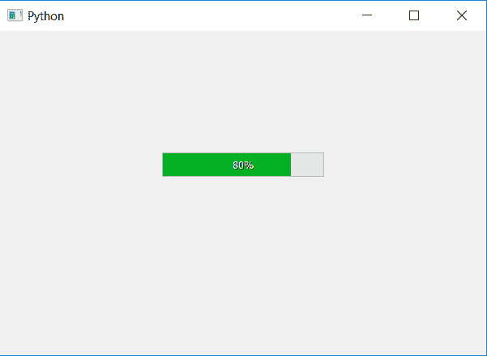

# PyQt5–如何设置进度条最小值？

> 原文:[https://www . geesforgeks . org/pyqt 5-如何设置进度条最小值/](https://www.geeksforgeeks.org/pyqt5-how-to-set-minimum-value-of-progress-bar/)

在本文中，我们将看到如何设置进度条的最小值。默认情况下，进度条的最小值为 0，但我们可以根据需要进行更改。为此我们将使用`setMinimum`方法，这将改变进度条的最大值。

如果我们改变最小值，百分比也会相应改变

```
percentage = ((value_passed - minimum_value)/(maximum_value - minimum_value))*100
```

这里，最大值= 100，值 _ 传递，最小值由用户设置。

> **语法:**bar . set minimum(minimum _ value)
> 
> **自变量:**以整数为自变量。
> 
> **执行的动作:**将设置进度条的最小值。

**代码:**

```
# importing libraries
from PyQt5.QtWidgets import * 
from PyQt5 import QtCore, QtGui
from PyQt5.QtGui import * 
from PyQt5.QtCore import * 
import sys

class Window(QMainWindow):

    def __init__(self):
        super().__init__()

        # setting title
        self.setWindowTitle("Python ")

        # setting geometry
        self.setGeometry(100, 100, 600, 400)

        # calling method
        self.UiComponents()

        # showing all the widgets
        self.show()

    # method for widgets
    def UiComponents(self):

        # creating progress bar
        bar = QProgressBar(self)

        # setting geometry to progress bar
        bar.setGeometry(200, 150, 200, 30)

        # setting minimum value of progress bar to 50
        bar.setMinimum(50)

        # setting value to progress bar
        bar.setValue(90)

        # setting alignment to centre
        bar.setAlignment(Qt.AlignCenter)

# create pyqt5 app
App = QApplication(sys.argv)

# create the instance of our Window
window = Window()

# start the app
sys.exit(App.exec())
```

**输出:**
