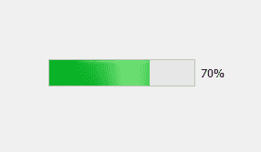
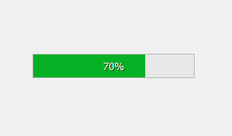
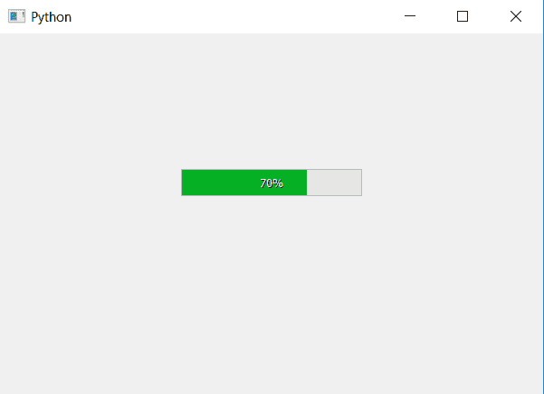

# PyQt5 |如何在进度条中间设置百分比指标？

> 原文:[https://www . geesforgeks . org/pyqt 5-如何在进度条中间设置百分比指标/](https://www.geeksforgeeks.org/pyqt5-how-to-set-percentage-indicator-in-middle-of-progress-bar/)

在本文中，我们将看到如何在进度条中设置百分比指示器。当我们创建进度条时，百分比指示器默认位于进度条的右侧，即进度条的外部。

以下是正常百分比指标的外观与内部外观。
 

> **为了做到这一点，我们将做以下工作:**
> 
> 1.创建进度条。
> 2。将其对齐方式设置为居中

为了改变进度条的对齐方式，我们将使用`setAlignment`方法。

```
# importing libraries
from PyQt5.QtWidgets import * 
from PyQt5 import QtCore
from PyQt5.QtGui import * 
from PyQt5.QtCore import * 
import sys

class Window(QMainWindow):
    def __init__(self):
        super().__init__()

        # setting title
        self.setWindowTitle("Python ")

        # setting geometry
        self.setGeometry(100, 100, 600, 400)

        # calling method
        self.UiComponents()

        # showing all the widgets
        self.show()

    # method for widgets
    def UiComponents(self):

        # creating progress bar
        bar = QProgressBar(self)

        # setting geometry to progress bar
        bar.setGeometry(200, 150, 200, 30)

        # set value to progress bar
        bar.setValue(70)

        # changing the alignment of progress bar
        bar.setAlignment(QtCore.Qt.AlignCenter)

# create pyqt5 app
App = QApplication(sys.argv)

# create the instance of our Window
window = Window()

# start the app
sys.exit(App.exec())
```

**输出:**
