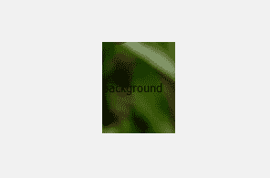
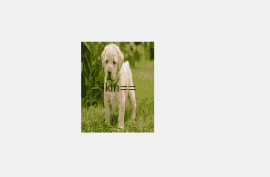
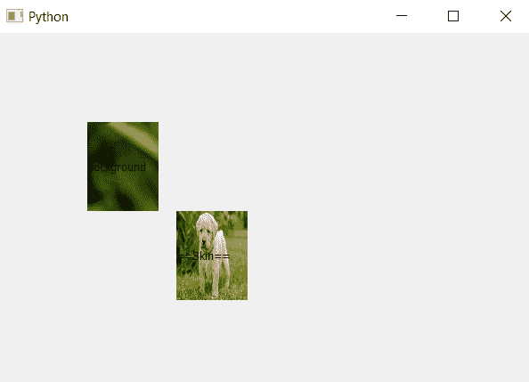

# pyqt 5–如何设置标签的皮肤？

> 原文:[https://www . geesforgeks . org/pyqt 5-如何设置标签皮肤/](https://www.geeksforgeeks.org/pyqt5-how-to-set-skin-of-label/)

与设置背景图像不同，皮肤根据标签的大小进行自我调整。在背景图像中，如果图像尺寸较大而标签尺寸较小，则只有包含标签尺寸的图像部分是可显示的。下面是背景图片和标签皮肤的区别。

对于此图像:


标签的背景图和标签的皮肤会是这样的:
 

为了做到这一点，我们将使用`setStyleSheet()`方法。

> **语法:**label .set 样式表(“边框-图像:URL(image . png)；”)
> 
> **自变量:**它以字符串为自变量。
> 
> **执行的操作:**将图像设置为标签的皮肤

**代码:**

```
# importing the required libraries

from PyQt5.QtCore import * 
from PyQt5.QtGui import * 
from PyQt5.QtWidgets import * 
import sys

class Window(QMainWindow):
    def __init__(self):
        super().__init__()

        # set the title
        self.setWindowTitle("Python")

        # setting  the geometry of window
        self.setGeometry(60, 60, 600, 400)

        # creating a label widget
        self.label_1 = QLabel("background", self)

        # moving position
        self.label_1.move(100, 100)

        # setting up the border
        self.label_1.setStyleSheet("border :5px solid blue;")

        # setting background image
        self.label_1.setStyleSheet("background-image :url(image.png);")

        # resizing label
        self.label_1.resize(80, 100)
        # creating a label widget
        self.label_2 = QLabel("== Skin ==", self)

        # moving position
        self.label_2.move(200, 200)

        # setting skin for label
        self.label_2.setStyleSheet("border-image : url(image.png);")

        # resizing the label
        self.label_2.resize(80, 100)

        # show all the widgets
        self.show()

# create pyqt5 app
App = QApplication(sys.argv)

# create the instance of our Window
window = Window()

# start the app
sys.exit(App.exec())
```

**输出:**
