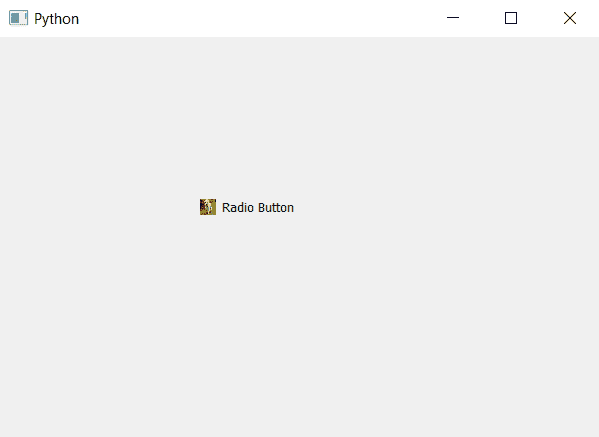

# pyqt 5–如何将皮肤设置为单选按钮的指示器？

> 原文:[https://www . geeksforgeeks . org/pyqt 5-如何将皮肤设置为无线电指示器按钮/](https://www.geeksforgeeks.org/pyqt5-how-to-set-skin-to-indicator-of-radiobutton/)

在本文中，我们将了解如何将皮肤设置为单选按钮的指示器。单选按钮基本上有两个部分，一个是指示器，另一个是显示文本的标签部分。

皮肤是一个背景图像，它会根据指示器的大小自行调整。为了给指示器设置外观，我们必须更改单选按钮的样式表。下面是样式表代码。

```
QRadioButton::indicator
{
border-image : url(image.png);
}

```

下面是实现

```
# importing libraries
from PyQt5.QtWidgets import * 
from PyQt5 import QtCore, QtGui
from PyQt5.QtGui import * 
from PyQt5.QtCore import * 
import sys

class Window(QMainWindow):

    def __init__(self):
        super().__init__()

        # setting title
        self.setWindowTitle("Python ")

        # setting geometry
        self.setGeometry(100, 100, 600, 400)

        # calling method
        self.UiComponents()

        # showing all the widgets
        self.show()

    # method for widgets
    def UiComponents(self):
        # creating a radio button
        self.radio_button = QRadioButton(self)

        # setting geometry of radio button
        self.radio_button.setGeometry(200, 150, 120, 40)

        # setting text to radio button
        self.radio_button.setText("Radio Button")

        # changing style sheet code of radio button
        # setting skin for indicator radio button
        self.radio_button.setStyleSheet("QRadioButton::indicator"
                                        "{"
                                        "border-image: url(image.png);"
                                        "}")

# create pyqt5 app
App = QApplication(sys.argv)

# create the instance of our Window
window = Window()

# start the app
sys.exit(App.exec())
```

**输出:**
