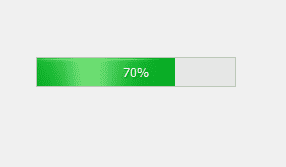
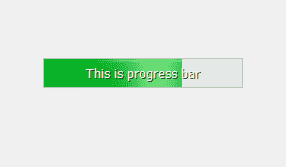
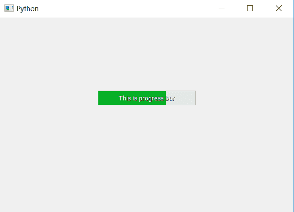

# pyqt 5–如何设置进度条的文字？

> 原文:[https://www . geesforgeks . org/pyqt 5-如何将文本设置为进度条/](https://www.geeksforgeeks.org/pyqt5-how-to-set-text-to-progress-bar/)

在本文中，我们将看到如何设置进度条的文本。当我们创建进度条时，只有进度百分比文本是可见的，但我们也可以在其上设置一些文本。

下面是普通进度条与带有文本的进度条的对比。
 

为了做到这一点，我们将使用`**setFormat**`方法，虽然它是用来设置格式，即百分比指标，但如果我们传递正常的文本给它，它将显示在进程栏。

```
# importing libraries
from PyQt5.QtWidgets import * 
from PyQt5 import QtCore, QtGui
from PyQt5.QtGui import * 
from PyQt5.QtCore import * 
import sys

class Window(QMainWindow):

    def __init__(self):
        super().__init__()

        # setting title
        self.setWindowTitle("Python ")

        # setting geometry
        self.setGeometry(100, 100, 600, 400)

        # calling method
        self.UiComponents()

        # showing all the widgets
        self.show()

    # method for widgets
    def UiComponents(self):

        # creating progress bar
        bar = QProgressBar(self)

        # setting geometry to progress bar
        bar.setGeometry(200, 150, 200, 30)

        # set value to progress bar
        bar.setValue(70)

        # setting text 
        bar.setFormat('This is progress bar')

        # setting alignment to centre
        bar.setAlignment(Qt.AlignCenter)

# create pyqt5 app
App = QApplication(sys.argv)

# create the instance of our Window
window = Window()

# start the app
sys.exit(App.exec())
```

**输出:**
