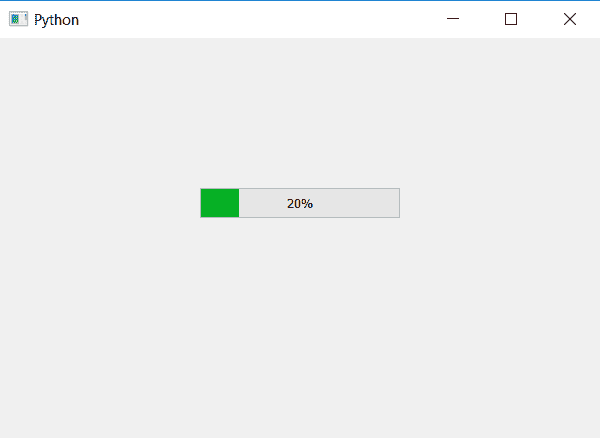

# PyQt5–如何设置进度条的最大值？

> 原文:[https://www . geesforgeks . org/pyqt 5-如何设置进度条的最大值/](https://www.geeksforgeeks.org/pyqt5-how-to-set-the-maximum-value-of-progress-bar/)

在本文中，我们将看到如何设置进度条的最大值。默认情况下，进度条的最大值是 100，但是我们可以根据需要进行更改。为此我们将使用`setMaximum`方法，这将改变进度条的最大值。

**注意:**当我们使用`setValue`方法将值设置到进度条时，百分比可能等于也可能不等于传入的值，这取决于进度条的范围。

```py
percentage = ((value_passed - minimum_value)/(maximum_value - minimum_value))*100
```

这里，最小值= 0，传递的值和最大值由用户设置。

> **语法:**bar . set maximum(max _ value)
> 
> **论证:**需要论证。
> 
> **执行的动作:**会改变进度条的最大值。

下面是实现。

```py
# importing libraries
from PyQt5.QtWidgets import * 
from PyQt5 import QtCore, QtGui
from PyQt5.QtGui import * 
from PyQt5.QtCore import * 
import sys

class Window(QMainWindow):

    def __init__(self):
        super().__init__()

        # setting title
        self.setWindowTitle("Python ")

        # setting geometry
        self.setGeometry(100, 100, 600, 400)

        # calling method
        self.UiComponents()

        # showing all the widgets
        self.show()

    # method for widgets
    def UiComponents(self):

        # creating progress bar
        bar = QProgressBar(self)

        # setting geometry to progress bar
        bar.setGeometry(200, 150, 200, 30)

        # setting maximum value of progress bar to 1000
        bar.setMaximum(1000)

        # setting value to progress bar
        bar.setValue(200)

        # setting alignment to centre
        bar.setAlignment(Qt.AlignCenter)

# create pyqt5 app
App = QApplication(sys.argv)

# create the instance of our Window
window = Window()

# start the app
sys.exit(App.exec())
```

**输出:**
