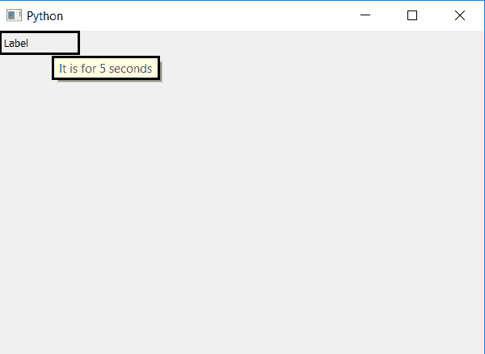

# PyQt5–如何设置标签的工具提示持续时间|设置工具提示持续时间方法

> 原文:[https://www . geesforgeks . org/pyqt 5-如何设置-工具提示-持续时间-针对标签-设置工具提示持续时间-方法/](https://www.geeksforgeeks.org/pyqt5-how-to-set-tooltip-duration-for-label-settooltipduration-method/)

在 PyQt5 中，有一个使用 set tool tip()方法设置工具提示的选项，**工具提示**或*信息提示*或*提示*是一个常见的图形用户界面元素。它与光标(通常是指针)结合使用。用户将指针悬停在某个项目上，而不单击它，工具提示可能会显示为一个小的“悬停框”，其中包含有关该项目的信息。
默认情况下，刀具提示没有时间限制，即提示出现的时间。在本文中，我们将看到如何为标签设置工具提示持续时间。为此，我们将使用 setToolTipDuration()方法。

> **语法:**label . settooltipduration(ms)
> **参数:**它以整数为参数，整数指毫秒。
> **执行的动作:**设置标签工具提示的持续时间。

**代码:**

## 蟒蛇 3

```py
# importing the required libraries

from PyQt5.QtCore import *
from PyQt5.QtGui import *
from PyQt5.QtWidgets import *
import sys

class Window(QMainWindow):
    def __init__(self):
        super().__init__()

        # set the title
        self.setWindowTitle("Python")

        # setting geometry
        self.setGeometry(100, 100, 600, 400)
        # creating a label widget
        self.label_1 = QLabel("Label", self)

        # moving position
        self.label_1.move(0, 0)

        # setting up the border
        self.label_1.setStyleSheet("border :3px solid black;")

        # setting label tool tip
        self.label_1.setToolTip("It is for 5 seconds")

        # setting time duration
        self.label_1.setToolTipDuration(500)

        # show all the widgets
        self.show()

# create pyqt5 app
App = QApplication(sys.argv)

# create the instance of our Window
window = Window()

# start the app
sys.exit(App.exec())
```

**输出:**

