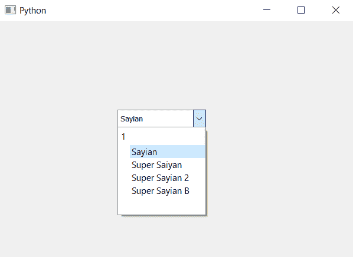

# PyQt5–如何设置组合框的视图

> 原文:[https://www . geesforgeks . org/pyqt 5-如何设置查看组合框/](https://www.geeksforgeeks.org/pyqt5-how-to-set-view-to-the-combo-box/)

在本文中，我们将看到如何设置组合框的视图。视图主要帮助我们改变下拉列表的视图。为了设置组合框的视图，我们将使用`setView`方法。

> **语法:**组合框.设置视图(视图)
> 
> **论证:**它以观点为论证
> 
> **返回:**无

以下是实施–

```
# importing libraries
from PyQt5.QtWidgets import *
from PyQt5 import QtCore, QtGui
from PyQt5.QtGui import *
from PyQt5.QtCore import *

import sys

class Window(QMainWindow):

    def __init__(self):
        super().__init__()

        # setting title
        self.setWindowTitle("Python ")

        # setting geometry
        self.setGeometry(100, 100, 600, 400)

        # calling method
        self.UiComponents()

        # showing all the widgets
        self.show()

    # method for widgets
    def UiComponents(self):

        # creating a combo box widget
        self.combo_box = QComboBox(self)

        # setting geometry of combo box
        self.combo_box.setGeometry(200, 150, 150, 30)

        # geek list
        geek_list = ["Sayian", "Super Saiyan", "Super Sayian 2", 
                                               "Super Sayian B"]

        # making it editable
        self.combo_box.setEditable(True)

        # creating a view
        view = QTreeView()

        # setting view to combo box
        self.combo_box.setView(view)

        # adding list of items to combo box
        self.combo_box.addItems(geek_list)

# create pyqt5 app
App = QApplication(sys.argv)

# create the instance of our Window
window = Window()

# start the app
sys.exit(App.exec())
```

**输出:**
