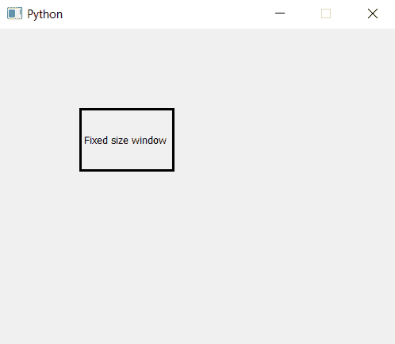

# PyQt5–如何停止调整窗口大小| setFixedSize()方法

> 原文:[https://www . geeksforgeeks . org/pyqt 5-如何停止调整窗口大小-setfixedsize-method/](https://www.geeksforgeeks.org/pyqt5-how-to-stop-resizing-of-window-setfixedsize-method/)

在本文中，我们将看到如何停止调整主窗口的大小。制作窗口时，我们可以选择全屏显示和使用光标改变窗口大小。通过使用`setFizedSize()`方法，我们可以防止图像的大小调整。

> **语法:** self.setFixedSize(宽度、高度)
> 
> **自变量:**取两个整数作为自变量，即宽度和高度。
> 
> **执行的动作:**设置窗口的固定大小。

**代码:**

```py
# importing the required libraries

from PyQt5.QtCore import * 
from PyQt5.QtGui import * 
from PyQt5.QtWidgets import * 
import sys

class Window(QMainWindow):
    def __init__(self):
        super().__init__()

        # set the title
        self.setWindowTitle("Python")

        width = 500
        height = 400
        # setting  the fixed size of window
        self.setFixedSize(width, height)

        # creating a label widget
        self.label_1 = QLabel("Fixed size window", self)

        # moving position
        self.label_1.move(100, 100)

        # setting up the border
        self.label_1.setStyleSheet("border :3px solid black;")

        # resizing label
        self.label_1.resize(120, 80)

        # show all the widgets
        self.show()

# create pyqt5 app
App = QApplication(sys.argv)

# create the instance of our Window
window = Window()

# start the app
sys.exit(App.exec())
```

**输出:**
