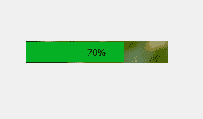
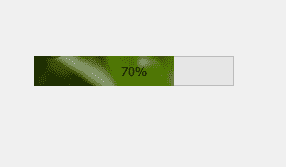
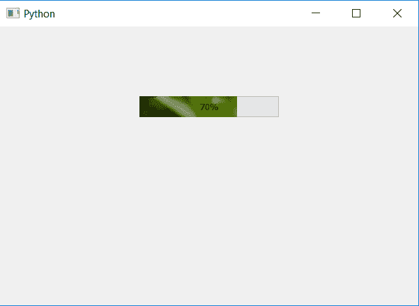

# pyqt 5–作为进度条的图像条

> 原文:[https://www . geesforgeks . org/pyqt 5-image-bar-as-progress-bar/](https://www.geeksforgeeks.org/pyqt5-image-bar-as-progress-bar/)

在这篇文章中，我们将看到如何添加图像到进度条栏。我们可以设置背景图像，但是为了将图像设置为条，我们必须修改进度条块 CSS，下面是普通背景图像和条的背景图像的外观。

 

为了做到这一点，下面是块文件的 CSS 样式表

```py
QProgressBar::chunk
{
 background-image : url(image.png);
}

```

这个样式表是由`setStyleSheet`方法使用的，下面是实现

```py
# importing libraries
from PyQt5.QtWidgets import * 
from PyQt5 import QtCore, QtGui
from PyQt5.QtGui import * 
from PyQt5.QtCore import * 
import sys

class Window(QMainWindow):

    def __init__(self):
        super().__init__()

        # setting title
        self.setWindowTitle("Python ")

        # setting geometry
        self.setGeometry(100, 100, 600, 400)

        # calling method
        self.UiComponents()

        # showing all the widgets
        self.show()

    # method for widgets
    def UiComponents(self):
        # creating progress bar
        bar = QProgressBar(self)

        # setting geometry to progress bar
        bar.setGeometry(200, 100, 200, 30)

        # setting the value
        bar.setValue(70)

        # setting alignment to center
        bar.setAlignment(Qt.AlignCenter)

        # adding background image to bar
        bar.setStyleSheet(
                          "QProgressBar::chunk "
                          "{"
                          "background-image: url(image.png);"
                          "}"
                          )

App = QApplication(sys.argv)

# create the instance of our Window
window = Window()

# start the app
sys.exit(App.exec())
```

**输出:**
