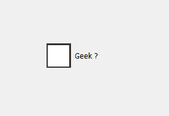
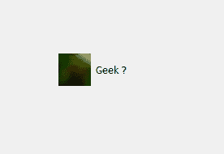
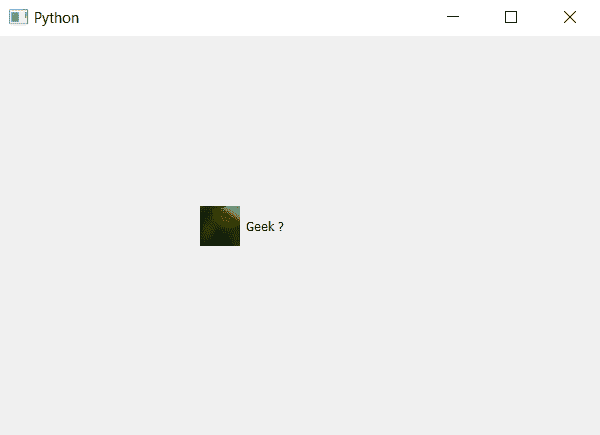

# pyqt 5–复选框的图像指示器

> 原文:[https://www . geesforgeks . org/pyqt 5-图像-指示符复选框/](https://www.geeksforgeeks.org/pyqt5-image-indicator-of-check-box/)

复选框基本上分为两个部分，一个是默认情况下位于左侧的指示器，另一个是复选框本身，即上面有文本的标签部分。在本文中，我们将了解如何将图像设置为指示器。

下面是复选框的正常指示器与带有指示器图像的复选框的图示。
 

为了将图像设置为指示器，我们必须更改复选框指示器的样式表。下面是与复选框对象一起使用的样式表代码。

```
QCheckBox::indicator
{
background-image :url(image.png);
}

```

下面是实现。

```
# importing libraries
from PyQt5.QtWidgets import * 
from PyQt5 import QtCore, QtGui
from PyQt5.QtGui import * 
from PyQt5.QtCore import * 
import sys

class Window(QMainWindow):

    def __init__(self):
        super().__init__()

        # setting title
        self.setWindowTitle("Python ")

        # setting geometry
        self.setGeometry(100, 100, 600, 400)

        # calling method
        self.UiComponents()

        # showing all the widgets
        self.show()

    # method for widgets
    def UiComponents(self):

        # creating the check-box
        checkbox = QCheckBox('Geek ?', self)

        # setting geometry of check box
        checkbox.setGeometry(200, 150, 100, 80)

        # setting stylesheet
        # adding background image to indicator of check box 
        # and changing with and height of indicator
        checkbox.setStyleSheet("QCheckBox::indicator"
                               "{"
                               "background-image : url(image.png);"
                               "width :40px;"
                               "height : 40px;"
                               "}")

# create pyqt5 app
App = QApplication(sys.argv)

# create the instance of our Window
window = Window()

# start the app
sys.exit(App.exec())
```

**输出:**
