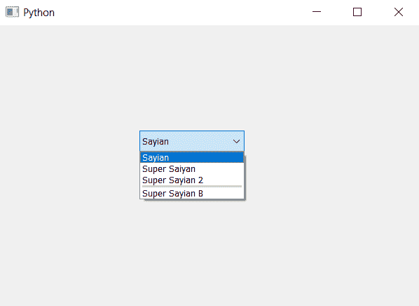

# PyQt5–增加组合框项目之间的分隔符尺寸

> 原文:[https://www . geeksforgeeks . org/pyqt 5-增加组合框中项目分隔符的大小/](https://www.geeksforgeeks.org/pyqt5-increase-size-of-separator-in-between-the-item-of-combobox/)

在本文中，我们将看到如何在组合框中的所需索引处增加分隔符的大小。默认情况下，没有分隔符。分隔符是两个项目之间的黑线，为了添加分隔符，我们使用 insertSeparator 方法。下图显示了带有分隔符的组合框项目的外观–


为了增加分隔符的大小，我们必须多次使用 insertSeparator 方法，索引值等于或大于期望的索引，这将增加给定索引的分隔符的大小。

> **语法:**
> combo _ box . insert separator(index)
> combo _ box . insert separator(index)
> T5】参数:它以整数为参数即 index
> **执行的动作:**它会在给定的索引处添加分隔符，使用相同索引的相同语句会增加分隔符
> 的大小

**注意:**指标值必须大于或等于所需指标。
下面是实现–

## 蟒蛇 3

```
# importing libraries
from PyQt5.QtWidgets import *
from PyQt5 import QtCore, QtGui
from PyQt5.QtGui import *
from PyQt5.QtCore import *
import sys

class Window(QMainWindow):

    def __init__(self):
        super().__init__()

        # setting title
        self.setWindowTitle("Python ")

        # setting geometry
        self.setGeometry(100, 100, 600, 400)

        # calling method
        self.UiComponents()

        # showing all the widgets
        self.show()

    # method for widgets
    def UiComponents(self):

        # creating a combo box widget
        self.combo_box = QComboBox(self)

        # setting geometry of combo box
        self.combo_box.setGeometry(200, 150, 150, 30)

        # geek list
        geek_list = ["Sayian", "Super Saiyan", "Super Sayian 2", "Super Sayian B"]

        # adding list of items to combo box
        self.combo_box.addItems(geek_list)

        # index
        index = 3

        # adding separator at given index
        self.combo_box.insertSeparator(index)

        # increasing the size of separator
        self.combo_box.insertSeparator(index)
        self.combo_box.insertSeparator(index)

# create pyqt5 app
App = QApplication(sys.argv)

# create the instance of our Window
window = Window()

# start the app
sys.exit(App.exec())
```

**输出:**

