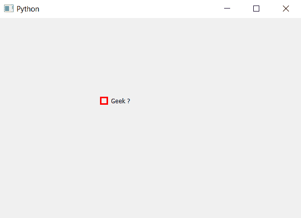

# PyQt5–复选框的指示器边框

> 原文:[https://www . geeksforgeeks . org/pyqt 5-复选框的边界指示器/](https://www.geeksforgeeks.org/pyqt5-indicator-border-of-check-box/)

在本文中，我们将看到如何将边框设置为复选框的指示器，虽然默认情况下指示器有自己的边框，但我们也可以编辑它，我们可以更改边框的大小和颜色。

为了做到这一点，我们必须借助`setStyleSheet`方法更改样式表代码，下面是样式表代码。

```py
QCheckBox::indicator
{
border : 3px solid red;
}

```

下面是实现。

```py
# importing libraries
from PyQt5.QtWidgets import * 
from PyQt5 import QtCore, QtGui
from PyQt5.QtGui import * 
from PyQt5.QtCore import * 
import sys

class Window(QMainWindow):

    def __init__(self):
        super().__init__()

        # setting title
        self.setWindowTitle("Python ")

        # setting geometry
        self.setGeometry(100, 100, 600, 400)

        # calling method
        self.UiComponents()

        # showing all the widgets
        self.show()

    # method for widgets
    def UiComponents(self):

        # creating the check-box
        checkbox = QCheckBox('Geek ?', self)

        # setting geometry of check box
        checkbox.setGeometry(200, 150, 100, 30)

        # changing border of indicator in checkbox
        checkbox.setStyleSheet("QCheckBox::indicator"
                               "{"
                               "border : 3px solid red;"
                               "}")

# create pyqt5 app
App = QApplication(sys.argv)

# create the instance of our Window
window = Window()

# start the app
sys.exit(App.exec())
```

**输出:**
