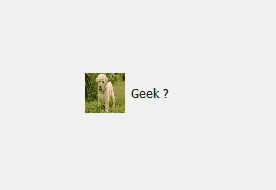
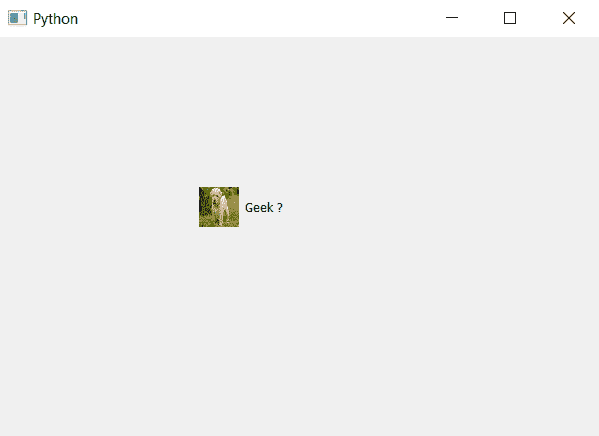

# PyQt5–复选框的指示器外壳

> 原文:[https://www . geesforgeks . org/pyqt 5-皮肤指示器复选框/](https://www.geeksforgeeks.org/pyqt5-indicator-skin-of-check-box/)

在本文中，我们将看到如何将皮肤设置为复选框的指示器。与背景图像不同，皮肤会根据指示器的大小自行调整。下面是带有背景图像的指示器和带有皮肤的指示器的表示。

 

为此，我们必须更改与复选框对象一起使用的指示器的样式表代码，下面是样式表代码。

```py
QCheckBox::indicator
{
border-image : url(image.png);
}

```

下面是实现。

```py
# importing libraries
from PyQt5.QtWidgets import * 
from PyQt5 import QtCore, QtGui
from PyQt5.QtGui import * 
from PyQt5.QtCore import * 
import sys

class Window(QMainWindow):

    def __init__(self):
        super().__init__()

        # setting title
        self.setWindowTitle("Python ")

        # setting geometry
        self.setGeometry(100, 100, 600, 400)

        # calling method
        self.UiComponents()

        # showing all the widgets
        self.show()

    # method for widgets
    def UiComponents(self):

        # creating the check-box
        checkbox = QCheckBox('Geek ?', self)

        # setting geometry of check box
        checkbox.setGeometry(200, 150, 100, 40)

        # setting stylesheet
        # adding skin to indicator of check box
        # changing width and height of indicator
        checkbox.setStyleSheet("QCheckBox::indicator"
                               "{"
                               "border-image : url(image.png);"
                               "width :40px;"
                               "height :40px;"
                               "}")

# create pyqt5 app
App = QApplication(sys.argv)

# create the instance of our Window
window = Window()

# start the app
sys.exit(App.exec())
```

**输出:**
