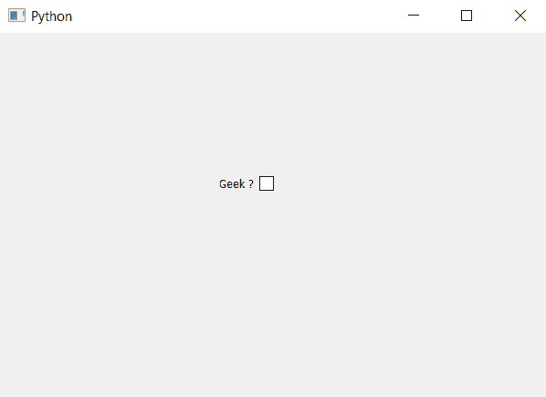

# 复选框

的 PyQt5–isRightToLeft()方法

> 原文:[https://www . geeksforgeeks . org/pyqt 5-isrighttoleft-method-for-check-box/](https://www.geeksforgeeks.org/pyqt5-isrighttoleft-method-for-check-box/)

当我们默认创建一个复选框时，指示器在左手边，我们称之为从左到右的方向，尽管我们可以使用`setLayoutDirection`方法改变它的方向。`isRightToLeft`方法用于检查布局方向是否从右向左，默认布局方向返回 False。

> **语法:** checkbox.isRightToLeft()
> 
> **论证:**不需要论证。
> 
> **返回:**返回 bool，布局方向从右向左为 True，否则为 False。

下面是实现

```
# importing libraries
from PyQt5.QtWidgets import * 
from PyQt5 import QtCore, QtGui
from PyQt5.QtGui import * 
from PyQt5.QtCore import * 
import sys

class Window(QMainWindow):

    def __init__(self):
        super().__init__()

        # setting title
        self.setWindowTitle("Python ")

        # setting geometry
        self.setGeometry(100, 100, 600, 400)

        # calling method
        self.UiComponents()

        # showing all the widgets
        self.show()

    # method for widgets
    def UiComponents(self):

        # creating the check-box
        checkbox = QCheckBox('Geek ?', self)

        # setting geometry of check box
        checkbox.setGeometry(200, 150, 100, 30)

        # checking direction
        check = checkbox.isRightToLeft()

        # printing the check
        print("Before changing direction  : " + str(check))

        # changing position of indicator
        checkbox.setLayoutDirection(Qt.RightToLeft)

        # checking direction
        check = checkbox.isRightToLeft()

        # printing the check
        print("After changing direction  : " + str(check))

# create pyqt5 app
App = QApplication(sys.argv)

# create the instance of our Window
window = Window()

# start the app
sys.exit(App.exec())
```

**输出:**

```
Before changing direction  : False
After changing direction  : True

```

