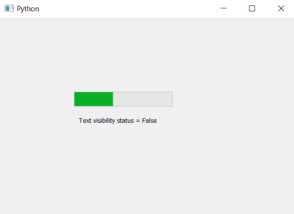

# 进度条的 PyQt5–istexvisible()方法

> 原文:[https://www . geesforgeks . org/pyqt 5-istexvisible-method-for-progress-bar/](https://www.geeksforgeeks.org/pyqt5-istextvisible-method-for-progress-bar/)

当我们创建进度条时，默认情况下百分比是可见的。虽然我们可以使用`setTextVisible`方法改变文本的可见性状态。`isTextVisible`方法用于检查进度条中的文本可见性状态。

> **语法:** bar.isTextVisible()
> 
> **论证:**不需要论证。
> 
> **返回:**返回 bool，文本可见为 True，文本不可见为 False。

下面是实现。

```py
# importing libraries
from PyQt5.QtWidgets import * 
from PyQt5 import QtCore, QtGui
from PyQt5.QtGui import * 
from PyQt5.QtCore import * 
import sys

class Window(QMainWindow):

    def __init__(self):
        super().__init__()

        # setting title
        self.setWindowTitle("Python ")

        # setting geometry
        self.setGeometry(100, 100, 600, 400)

        # calling method
        self.UiComponents()

        # showing all the widgets
        self.show()

    # method for widgets
    def UiComponents(self):
        # creating progress bar
        bar = QProgressBar(self)

        # setting geometry to progress bar
        bar.setGeometry(150, 150, 200, 30)

        # set value to progress bar
        bar.setValue(40)

        # setting alignment to center
        bar.setAlignment(Qt.AlignCenter)

        # setting text visibility to false
        bar.setTextVisible(False)

        # getting the visibility status
        visible = bar.isTextVisible()

        # creating label to print visibility status
        label = QLabel("Text visibility status = " + str(visible), self)

        # adjusting the size of label
        label.adjustSize()

        # moving the label
        label.move(160, 200)

# create pyqt5 app
App = QApplication(sys.argv)

# create the instance of our Window
window = Window()

# start the app
sys.exit(App.exec())
```

**输出:**
