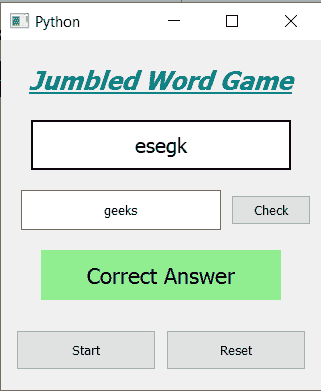

# PyQt5–混乱文字游戏

> 原文:[https://www.geeksforgeeks.org/pyqt5-jumble-word-game/](https://www.geeksforgeeks.org/pyqt5-jumble-word-game/)

在本文中，我们将看到如何使用 PyQt5 创建一个混乱的文字游戏。**冗杂单词游戏:**冗杂的单词给玩家，玩家要重新排列单词的字符才能做出正确有意义的单词。下面是游戏的样子



> **GUI 实现步骤:**
> 1。创建一个显示游戏名称的标题标签
> 2。创建显示冗杂单词的标签
> 3。获取文本的行编辑小部件
> 4。检查行编辑
> 5 旁边的输入文本的按钮。创建一个结果标签，告知答案是否正确，并更改其颜色
> 6。两个按钮开始和重置游戏
> 
> **后端实现步骤:**
> 1。创建单词列表
> 2。将动作添加到检查按钮
> 3。在检查按钮的动作中，获取输入文本，并将其与输入单词
> 4 进行比较。如果单词匹配显示结果正确并将颜色设置为绿色，否则将颜色设置为红色并说错
> 5。向开始按钮
> 5 添加动作。在开始按钮动作内，使用随机功能
> 6 从列表中获取当前单词。从当前单词创建一个混乱单词，并将其设置为混乱标签
> 7。移除结果标签的文本，并将颜色设置为黄色
> 8。向复位按钮
> 9 添加动作。在复位按钮动作内，将当前字设置为空白
> 10。从所有标签中移除文本，并将它们的颜色设置回原始颜色

下面是实现

```
# importing libraries
from PyQt5.QtWidgets import * 
from PyQt5 import QtCore, QtGui
from PyQt5.QtGui import * 
from PyQt5.QtCore import * 
import random
import sys

class Window(QMainWindow):

    def __init__(self):
        super().__init__()

        # setting title
        self.setWindowTitle("Python ")

        # setting geometry
        self.setGeometry(100, 100, 320, 350)

        # calling method
        self.UiComponents()

        # showing all the widgets
        self.show()

        # words
        self.words = ['red', 'cold', 'hot', 'geeks', 'rain', 
                           'black', 'snow', 'hills', 'code']

        # current word
        self.current_text = ""

    # method for components
    def UiComponents(self):

        # creating head label
        head = QLabel("Jumbled Word Game", self)

        # setting geometry to the head
        head.setGeometry(20, 10, 280, 60)

        # font
        font = QFont('Times', 15)
        font.setBold(True)
        font.setItalic(True)
        font.setUnderline(True)

        # setting font to the head
        head.setFont(font)

        # setting alignment of the head
        head.setAlignment(Qt.AlignCenter)

        # setting color effect to the head
        color = QGraphicsColorizeEffect(self)
        color.setColor(Qt.darkCyan)
        head.setGraphicsEffect(color)

        # creating label to show the jumbled word
        self.j_word = QLabel(self)

        # setting geometry
        self.j_word.setGeometry(30, 80, 260, 50)

        # setting style sheet
        self.j_word.setStyleSheet("border : 2px solid black; background : white;")

        # setting font
        self.j_word.setFont(QFont('Times', 12))

        # setting alignment
        self.j_word.setAlignment(Qt.AlignCenter)

        # creating a line edit widget to het the text
        self.input = QLineEdit(self)

        # setting geometry
        self.input.setGeometry(20, 150, 200, 40)

        # setting alignment
        self.input.setAlignment(Qt.AlignCenter)

        # creating push button to check the input
        self.check = QPushButton("Check", self)

        # setting geometry
        self.check.setGeometry(230, 155, 80, 30)

        # adding action to the check button
        self.check.clicked.connect(self.check_action)

        # result label
        self.result = QLabel(self)

        # setting geometry
        self.result.setGeometry(40, 210, 240, 50)

        # setting font
        self.result.setFont(QFont('Times', 13))

        # setting alignment
        self.result.setAlignment(Qt.AlignCenter)

        # setting style sheet
        self.result.setStyleSheet("border : 2px solid black; background : yellow;")

        # creating push buttons to start and reset the game
        start = QPushButton("Start", self)
        reset = QPushButton("Reset", self)

        # setting geometry to both the button
        start.setGeometry(15, 290, 140, 40)
        reset.setGeometry(165, 290, 140, 40)

        # adding action to both the buttons
        start.clicked.connect(self.start_action)
        reset.clicked.connect(self.reset_action)

    def check_action(self):

        # getting text from the line edit
        text = self.input.text()

        # checking if text is similar to the current text
        if text == self.current_text:
            self.result.setText("Correct Answer")

            # making result color grenn
            self.result.setStyleSheet("background : lightgreen;")

        else:
            self.result.setText("Wrong Answer")

            # making result color red
            self.result.setStyleSheet("background : red;")

    def start_action(self):

        # selecting one word
        self.current_text = random.choice(self.words)

        # sample() method shuffling the characters of the word
        random_word = random.sample(self.current_text, len(self.current_text))

        # join() method join the elements
        # of the iterator(e.g. list) with particular character .
        jumbled = ''.join(random_word)

        # setting text to the jumbled word
        self.j_word.setText(jumbled)

        # setting result text to blank
        self.result.setText("")

        # making result label color yellow
        self.result.setStyleSheet("border : 2px solid black; background : yellow;")

        # setting text of input to blank
        self.input.setText("")

    def reset_action(self):

        # setting current text blank
        self.current_text = ""

        # setting text of input to blank
        self.input.setText("")

        # clear the text of all the labels
        self.j_word.setText("")
        self.result.setText("")

        # making result label color yellow
        self.result.setStyleSheet("border : 2px solid black; background : yellow;")

# create pyqt5 app
App = QApplication(sys.argv)

# create the instance of our Window
window = Window()

# start the app
sys.exit(App.exec())
```

**输出:**

<video class="wp-video-shortcode" id="video-427486-1" width="640" height="700" preload="metadata" controls=""><source type="video/mp4" src="https://media.geeksforgeeks.org/wp-content/uploads/20200602190011/Python-2020-06-02-18-59-18.mp4?_=1">[https://media.geeksforgeeks.org/wp-content/uploads/20200602190011/Python-2020-06-02-18-59-18.mp4](https://media.geeksforgeeks.org/wp-content/uploads/20200602190011/Python-2020-06-02-18-59-18.mp4)</video>