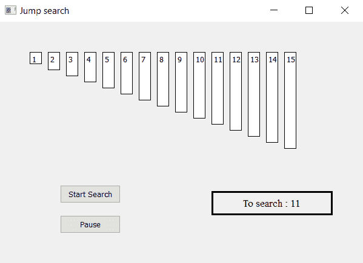

# PyQt5–跳转搜索可视化工具

> 原文:[https://www.geeksforgeeks.org/pyqt5-jump-search-visualizer/](https://www.geeksforgeeks.org/pyqt5-jump-search-visualizer/)

在本文中，我们将看到如何制作一个 PyQt5 应用程序，它将可视化[跳转搜索算法](https://www.geeksforgeeks.org/jump-search/)。

像二分搜索法一样，[跳转搜索](https://www.geeksforgeeks.org/jump-search/)是一种排序数组的搜索算法。基本思想是通过向前跳固定的步骤或跳过一些元素来代替搜索所有元素，从而检查更少的元素(比线性搜索)。



> **GUI 实现步骤:**
> 
> 1.根据给定的数字列表
> 2 创建标签列表。将它们的文字、边框、颜色和几何图形设置为彼此有相应的间隙
> 3。每个标签高度应与每个数字的值成比例
> 4。创建开始和暂停按钮，开始搜索并暂停搜索
> 5。创建结果标签以显示搜索状态
> 
> **算法实现步骤:**
> 
> 1.创建与给定数字对应的标签列表。
> 2。为跳转索引和线性搜索索引创建变量。此外，计数器和标志用于线性和跳跃搜索过程。
> 3。向按钮添加动作他们的动作应该改变标志状态，即开始动作应该使标志为真，暂停动作应该使标志为假。
> 4。创建计时器对象，该对象在每个特定时间后调用一个方法。
> 5。在计时器方法中，检查标志。如果标志为真，开始跳转搜索，检查跳转标志如果为真，开始跳转索引。
> 6。如果跳转索引值等于所需值，则使标签为绿色，并通过标签显示结果。如果索引值大于，停止索引的跳转，开始线性搜索。
> 7。通过线性搜索检查索引值，如果找到则通过标签显示，否则显示结果为未找到。

以下是实施–

```py
# importing libraries
from PyQt5.QtWidgets import * 
from PyQt5 import QtCore, QtGui
from PyQt5.QtGui import * 
from PyQt5.QtCore import * 
import sys

class Window(QMainWindow):

    # list of numbers
    number = [1, 2, 3, 4, 5, 6, 7, 8, 9, 10, 11, 12,  13, 14, 15]

    def __init__(self):
        super().__init__()

        # setting title
        self.setWindowTitle("Jump search ")

        # setting geometry
        self.setGeometry(100, 100, 600, 400)

        # calling method
        self.UiComponents()

        # showing all the widgets
        self.show()

    # method for widgets
    def UiComponents(self):

        # start flag
        self.start = False

        # linear search and binary search  flag
        self.linear = False
        self.jump = True

        # list to hold labels
        self.label_list = []

        # desired value
        self.desired = 11

        # step size
        self.step = 4

        # counter to calculate index
        self.counter = 0

        # index used to jumping
        self.index = 0

        # local index for linear search
        self.linear_index = 0

        # local counter
        c = 0

        # iterating list of numbers
        for i in self.number:

            # creating label for each number
            label = QLabel(str(i), self)

            # adding background color and border
            label.setStyleSheet("border : 1px solid black; background : white;")

            # aligning the text
            label.setAlignment(Qt.AlignTop)

            # setting geometry using local counter
            # first parameter is distance from left and second is distance from top
            # third is width and forth is height
            label.setGeometry(50 + c * 30, 50, 20, i * 10 + 10)

            # adding label to the label list
            self.label_list.append(label)

            # incrementing local counter
            c = c + 1

        # creating push button to start the search
        self.search_button = QPushButton("Start Search", self)

        # setting geometry of the button
        self.search_button.setGeometry(100, 270, 100, 30)

        # adding action to the search button
        self.search_button.clicked.connect(self.search_action)

        # creating push button to pause the search
        pause_button = QPushButton("Pause", self)

        # setting geometry of the button
        pause_button.setGeometry(100, 320, 100, 30)

        # adding action to the search button
        pause_button.clicked.connect(self.pause_action)

        # creating label to show the result
        self.result = QLabel("To search : " + str(self.desired), self)

        # setting geometry
        self.result.setGeometry(350, 280, 200, 40)

        # setting style sheet
        self.result.setStyleSheet("border : 3px solid black;")

        # adding font
        self.result.setFont(QFont('Times', 10))

        # setting alignment
        self.result.setAlignment(Qt.AlignCenter)

        # creating a timer object
        timer = QTimer(self)

        # adding action to timer
        timer.timeout.connect(self.showTime)

        # update the timer every 300 millisecond
        timer.start(500)

    # method called by timer
    def showTime(self):

        # checking if flag is true
        if self.start:
            # implementing jump search

            # implementing jumping gap
            if self.jump:

                # checking if jump index is greater then the length of list
                if self.counter * self.step >= len(self.number):

                    # setting linear indes
                    self.linear_index = self.index - self.step

                    # setting counter value
                    self.counter = 0

                    # making jumping false
                    self.jump = False

                    # making linear flag true
                    self.linear = True

                # updating the index
                self.index = self.step * self.counter

                # checking if desired value get found
                if self.number[self.index] == self.desired:

                    # stopping the search
                    self.start = False
                    self.jump = False

                    # show result in the result label
                    self.result.setText("Found at index : " + str(self.index))

                    # making the label color green
                    self.label_list[self.index].setStyleSheet("border : 2px solid green;"
                                                              "background-color : lightgreen;")

                # if not found
                else:
                    # making the label color grey
                    self.label_list[self.index].setStyleSheet("border : 1px solid black;"
                                                              "background-color : grey;")

                # if index value is greater
                if self.number[self.index] > self.desired:

                    # setting linear index
                    self.linear_index = self.index - self.step
                    # updating the counter value
                    self.counter = 0
                    # making linear flag True
                    self.linear = True

                    # stopping the jumping
                    self.jump = False

                # updating the counter
                self.counter += 1

                # updating the index
                self.index = self.step * self.counter

                # if index exceeds the limit
                if self.counter * self.step >= len(self.number):
                    # updating the linear search
                    self.linear_index = self.index - self.step

                    # updating the counter value
                    self.counter = 0

                    # stopping the jumping
                    self.jump = False

                    # starting linear search
                    self.linear = True

            # linear search
            if self.linear:
                # if counter become equal to steop
                if self.counter == self.step:
                    # stop the search
                    self.start = False
                    # show result i.e  not found
                    self.result.setText("Not found")

                # if linear index is negative
                if self.linear_index < 0:
                    # making it zero
                    self.linear_index = 0

                # checking value if found
                if self.number[self.counter + self.linear_index] == self.desired:
                    # stop the search
                    self.linear = False
                    self.start = False
                    # show result
                    self.result.setText("Found at index : " + str(self.counter + 
                                                                  self.linear_index))
                    # make label color green
                    self.label_list[self.counter + self.linear_index].setStyleSheet(
                                                           "border : 2px solid green;"
                                                           "background-color : lightgreen;")

                # if not found
                else:
                    # make label color grey
                    self.label_list[self.counter + self.linear_index].setStyleSheet(
                                                         "border : 1px solid black;"
                                                         " background-color : grey;")

                # updating the counter
                self.counter += 1

    # method called by search button
    def search_action(self):

        # making flag true
        self.start = True

        # showing text in result label
        self.result.setText("Started searching...")

    # method called by pause button
    def pause_action(self):

        # making flag false
        self.start = False

        # showing text in result label
        self.result.setText("Paused")

# create pyqt5 app
App = QApplication(sys.argv)

# create the instance of our Window
window = Window()

# start the app
sys.exit(App.exec())
```

**输出:**

<video class="wp-video-shortcode" id="video-399513-1" width="640" height="428" preload="metadata" controls=""><source type="video/mp4" src="https://media.geeksforgeeks.org/wp-content/uploads/20200420133815/Jump-search-20-04-2020-13_36_22.mp4?_=1">[https://media.geeksforgeeks.org/wp-content/uploads/20200420133815/Jump-search-20-04-2020-13_36_22.mp4](https://media.geeksforgeeks.org/wp-content/uploads/20200420133815/Jump-search-20-04-2020-13_36_22.mp4)</video>