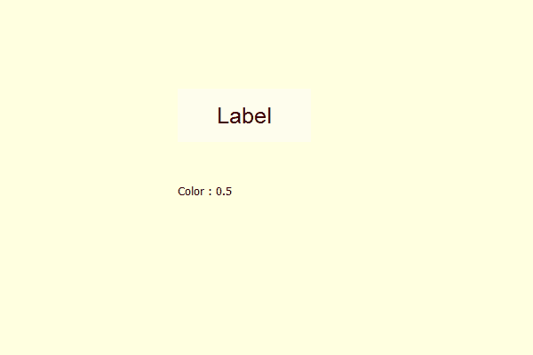

# PyQt5 标签–获取颜色效果的强度

> 原文:[https://www . geesforgeks . org/pyqt 5-标签-访问-色彩效果强度/](https://www.geeksforgeeks.org/pyqt5-label-accessing-the-strength-of-the-color-effect/)

在本文中，我们将看到如何访问标签的颜色效果的强度。默认情况下，标签没有颜色效果，尽管我们可以为标签创建颜色效果。色彩效果不像背景色，它更像是我们在图片上使用的彩色滤镜。强度是颜色效果的强度。

为了做到这一点，我们使用力量法。

> **语法:** color_effect.strength()
> 这里 color_effect 是 QGraphicsColorizeEffect 对象
> 
> **论证:**不需要论证
> 
> **返回:**返回浮点值

**注:**强度值范围 0-1.0

下面是实现

```
# importing libraries
from PyQt5.QtWidgets import * 
from PyQt5 import QtCore, QtGui
from PyQt5.QtGui import * 
from PyQt5.QtCore import * 
import sys

class Window(QMainWindow):

    def __init__(self):
        super().__init__()

        # making background color light yellow
        self.setStyleSheet("background : lightyellow;")

        # setting title
        self.setWindowTitle("Python ")

        # setting geometry
        self.setGeometry(100, 100, 600, 400)

        # calling method
        self.UiComponents()

        # showing all the widgets
        self.show()

    # method for widgets
    def UiComponents(self):

        # creating label
        label = QLabel("Label", self)

        # setting geometry to the label
        label.setGeometry(200, 100, 150, 60)

        # setting alignment to the label
        label.setAlignment(Qt.AlignCenter)

        # setting font
        label.setFont(QFont('Arial', 15))

        # creating a color effect
        color_effect = QGraphicsColorizeEffect()

        # setting color to color effect
        color_effect.setColor(Qt.darkRed)

        # setting strength
        color_effect.setStrength(0.5)

        # adding color effect to the label
        label.setGraphicsEffect(color_effect)

        # creating result label
        result = QLabel(self)

        # setting geometry to the result
        result.setGeometry(200, 200, 300, 30)

        # getting the strength
        strength = color_effect.strength()

        # setting text to result label
        result.setText("Color : " + str(strength))

# create pyqt5 app
App = QApplication(sys.argv)

# create the instance of our Window
window = Window()

# start the app
sys.exit(App.exec())
```

**输出:**
