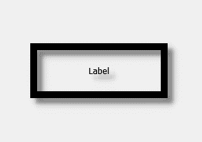

# PyQt5 标签–添加阴影

> 原文:[https://www.geeksforgeeks.org/pyqt5-label-adding-shadow/](https://www.geeksforgeeks.org/pyqt5-label-adding-shadow/)

在本文中，我们将了解如何在标签上添加阴影默认情况下，标签上没有阴影尽管我们可以在标签上创建阴影，下面是带有阴影框的标签的外观



> 为此，我们必须执行以下操作–
> 
> 1.创建标签
> 2。将几何图形设置为标签
> 3。创建一个 QGraphicsDropShadowEffect 对象
> 4。将模糊半径设置为对象(可选)
> 5。借助 setGraphicsEffect 方法将此对象添加到标签中

**语法:**

```py
# creating a QGraphicsDropShadowEffect object
shadow = QGraphicsDropShadowEffect()

# setting blur radius (optional step)
shadow.setBlurRadius(15)

# adding shadow to the label
label.setGraphicsEffect(shadow)

```

下面是实现

```py
# importing libraries
from PyQt5.QtWidgets import * 
from PyQt5 import QtCore, QtGui
from PyQt5.QtGui import * 
from PyQt5.QtCore import * 
import sys

class Window(QMainWindow):

    def __init__(self):
        super().__init__()

        # setting background color of window
        # self.setStyleSheet("background-color : black;")

        # setting title
        self.setWindowTitle("Python ")

        # setting geometry
        self.setGeometry(100, 100, 600, 400)

        # calling method
        self.UiComponents()

        # showing all the widgets
        self.show()

    # method for widgets
    def UiComponents(self):

        # creating label
        label = QLabel("Label", self)

        # setting alignment
        label.setAlignment(Qt.AlignCenter)

        # setting geometry to the label
        label.setGeometry(200, 150, 200, 80)

        # setting border
        label.setStyleSheet("border : 10px solid black")

        # creating a QGraphicsDropShadowEffect object
        shadow = QGraphicsDropShadowEffect()

        # setting blur radius
        shadow.setBlurRadius(15)

        # adding shadow to the label
        label.setGraphicsEffect(shadow)

# create pyqt5 app
App = QApplication(sys.argv)

# create the instance of our Window
window = Window()

# start the app
sys.exit(App.exec())
```

**输出:**
