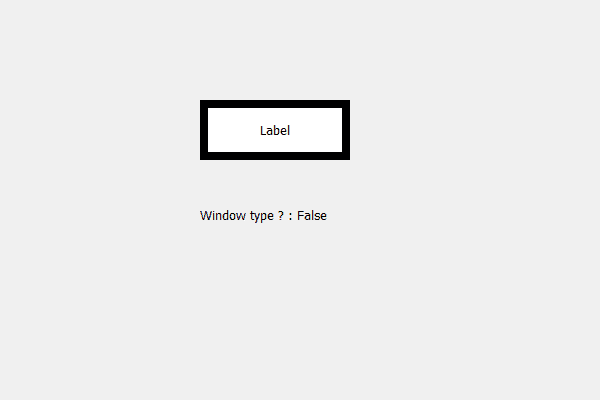

# PyQt5 标签–检查标签是否为窗口类型

> 原文:[https://www . geesforgeks . org/pyqt 5-标签检查-如果标签是窗口类型/](https://www.geeksforgeeks.org/pyqt5-label-checking-if-label-is-window-type/)

在本文中，我们将看到如何检查标签是否是窗口类型。窗口类型是一个属性，它告诉对象是否是窗口类型。

> 为了做到这一点，我们使用`isWindowType`方法
> 
> **语法:** label.isWindowType()
> 
> **论证:**不需要论证
> 
> **返回:**返回 bool

下面是实现

```
# importing libraries
from PyQt5.QtWidgets import * 
from PyQt5 import QtCore, QtGui
from PyQt5.QtGui import * 
from PyQt5.QtCore import * 
import sys

class Window(QMainWindow):

    def __init__(self):
        super().__init__()

        # setting title
        self.setWindowTitle("Python ")

        # setting geometry
        self.setGeometry(100, 100, 600, 400)

        # calling method
        self.UiComponents()

        # showing all the widgets
        self.show()

    # method for widgets
    def UiComponents(self):

        # creating label
        label = QLabel("Label", self)

        # setting alignment
        label.setAlignment(Qt.AlignCenter)

        # setting geometry to the label
        label.setGeometry(200, 100, 150, 60)

        # setting border
        label.setStyleSheet("border : 8px solid black;"
                            "background : white;")

        # checking if label is window type
        check = label.isWindowType()

        # making label
        result = QLabel(self)

        # setting geometry
        result.setGeometry(200, 200, 300, 30)

        # setting text
        result.setText("Window type ? : " + str(check))

# create pyqt5 app
App = QApplication(sys.argv)

# create the instance of our Window
window = Window()

# start the app
sys.exit(App.exec())
```

**输出:**
