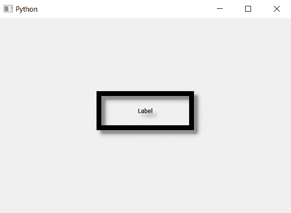

# PyQt5 标签–设置模糊半径为阴影

> 原文:[https://www . geesforgeks . org/pyqt 5-标签-设置-模糊-半径到阴影/](https://www.geeksforgeeks.org/pyqt5-label-setting-blur-radius-to-shadow/)

在本文中，我们将看到如何设置标签阴影的模糊半径。模糊半径，如果设置为 0，阴影将是清晰的，数字越高，它将越模糊，默认情况下模糊半径为 0。

> 为了借助`setBlurRadius`方法对标签阴影设置模糊半径
> 
> **语法:** shadow.setBlurRadius(n)
> 这里的 shadow 是 QGraphicsDropShadowEffect 对象
> 
> **自变量:**以 float 为自变量
> 
> **返回:**无

下面是实现

```py
# importing libraries
from PyQt5.QtWidgets import * 
from PyQt5 import QtCore, QtGui
from PyQt5.QtGui import * 
from PyQt5.QtCore import * 
import sys

class Window(QMainWindow):

    def __init__(self):
        super().__init__()

        # setting background color of window
        # self.setStyleSheet("background-color : black;")

        # setting title
        self.setWindowTitle("Python ")

        # setting geometry
        self.setGeometry(100, 100, 600, 400)

        # calling method
        self.UiComponents()

        # showing all the widgets
        self.show()

    # method for widgets
    def UiComponents(self):

        # creating label
        label = QLabel("Label", self)

        # setting alignment
        label.setAlignment(Qt.AlignCenter)

        # setting geometry to the label
        label.setGeometry(200, 150, 200, 80)

        # setting border
        label.setStyleSheet("border : 10px solid black")

        # creating a QGraphicsDropShadowEffect object
        shadow = QGraphicsDropShadowEffect()

        # setting blur radius
        shadow.setBlurRadius(15)

        # adding shadow to the label
        label.setGraphicsEffect(shadow)

# create pyqt5 app
App = QApplication(sys.argv)

# create the instance of our Window
window = Window()

# start the app
sys.exit(App.exec())
```

**输出:**
