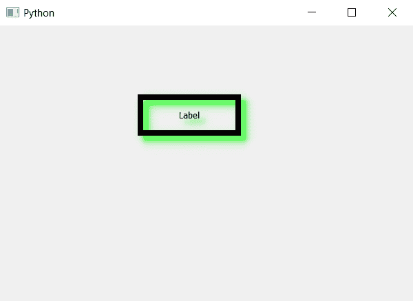

# PyQt5 标签–将颜色设置为阴影

> 原文:[https://www . geesforgeks . org/pyqt 5-标签设置-颜色到阴影/](https://www.geeksforgeeks.org/pyqt5-label-setting-color-to-shadow/)

在这篇文章中，我们将看到如何为标签设置阴影颜色，当我们为标签创建阴影时，它默认为黑色，尽管我们可以设置它的颜色。

> 为了借助`setColor`方法给标签阴影设置颜色
> 
> **语法:**shadow . setcolor(color _ object)
> 这里的 shadow 是 QGraphicsDropShadowEffect 对象
> 
> **自变量:**以颜色对象为自变量示例 Qt.green
> 
> **返回:**无

下面是实现

```py
# importing libraries
from PyQt5.QtWidgets import * 
from PyQt5 import QtCore, QtGui
from PyQt5.QtGui import * 
from PyQt5.QtCore import * 
import sys

class Window(QMainWindow):

    def __init__(self):
        super().__init__()

        # setting background color of window
        # self.setStyleSheet("background-color : black;")

        # setting title
        self.setWindowTitle("Python ")

        # setting geometry
        self.setGeometry(100, 100, 600, 400)

        # calling method
        self.UiComponents()

        # showing all the widgets
        self.show()

    # method for widgets
    def UiComponents(self):

        # creating label
        label = QLabel("Label", self)

        # setting alignment
        label.setAlignment(Qt.AlignCenter)

        # setting geometry to the label
        label.setGeometry(200, 100, 150, 60)

        # setting border
        label.setStyleSheet("border : 8px solid black")

        # creating a QGraphicsDropShadowEffect object
        shadow = QGraphicsDropShadowEffect()

        # setting blur radius
        shadow.setBlurRadius(20)

        # setting border color
        shadow.setColor(Qt.green)

        # adding shadow to the label
        label.setGraphicsEffect(shadow)

# create pyqt5 app
App = QApplication(sys.argv)

# create the instance of our Window
window = Window()

# start the app
sys.exit(App.exec())
```

**输出:**
