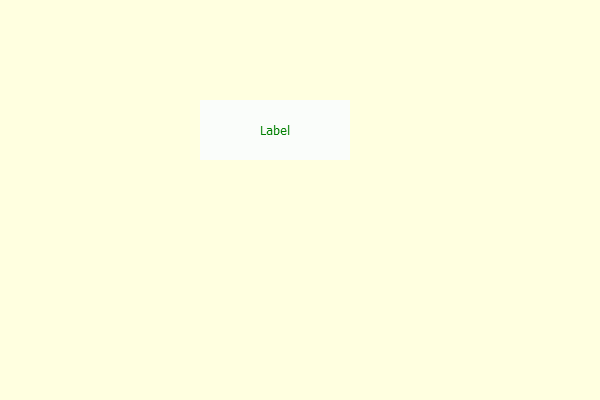

# PyQt5 标签–将颜色设置为颜色效果

> 原文:[https://www . geesforgeks . org/pyqt 5-标签设置-颜色到颜色效果/](https://www.geeksforgeeks.org/pyqt5-label-setting-color-to-the-color-effect/)

在本文中，我们将看到如何设置标签的颜色效果默认情况下，标签没有颜色效果，尽管我们可以为标签创建颜色效果。色彩效果不像背景色，它更像是我们在图片上使用的彩色滤镜。

> **语法:**color_effect . setcolor(color _ object)
> 这里 color _ effect 是 QGraphicsColorizeEffect 对象
> 
> **自变量:**以颜色对象为自变量示例 Qt.green
> 
> **返回:**返回无

下面是实现

```py
# importing libraries
from PyQt5.QtWidgets import * 
from PyQt5 import QtCore, QtGui
from PyQt5.QtGui import * 
from PyQt5.QtCore import * 
import sys

class Window(QMainWindow):

    def __init__(self):
        super().__init__()

        # making background color light yellow
        self.setStyleSheet("background : lightyellow;")

        # setting title
        self.setWindowTitle("Python ")

        # setting geometry
        self.setGeometry(100, 100, 600, 400)

        # calling method
        self.UiComponents()

        # showing all the widgets
        self.show()

    # method for widgets
    def UiComponents(self):

        # creating label
        label = QLabel("Label", self)

        # setting geometry to the label
        label.setGeometry(200, 100, 150, 60)

        # setting alignment to the label
        label.setAlignment(Qt.AlignCenter)

        # creating a color effect
        color_effect = QGraphicsColorizeEffect()

        # setting color to color effect
        color_effect.setColor(Qt.darkGreen)

        # adding color effect to the label
        label.setGraphicsEffect(color_effect)

# create pyqt5 app
App = QApplication(sys.argv)

# create the instance of our Window
window = Window()

# start the app
sys.exit(App.exec())
```

**语法:**
