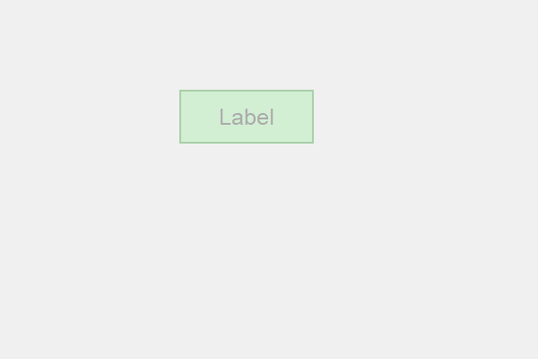

# PyQt5 标签–将不透明度设置为不透明度效果

> 原文:[https://www . geesforgeks . org/pyqt 5-标签设置-不透明度-级别到不透明度-效果/](https://www.geeksforgeeks.org/pyqt5-label-setting-opacity-level-to-the-opacity-effect/)

在这篇文章中，我们将看到如何设置标签的不透明度，不透明度值越大，标签越清晰可见，如果不透明度值越小，它将变得越透明。

为了做到这一点，我们使用`setOpacity`方法。

> **语法:**不透明度 _ 效果.设置容量(n)
> 
> **自变量:**以浮点值为自变量
> 
> **返回:**无

**注意:**不透明度值的范围从 0 到 1

下面是实现

```py
# importing libraries
from PyQt5.QtWidgets import * 
from PyQt5 import QtCore, QtGui
from PyQt5.QtGui import * 
from PyQt5.QtCore import * 
import sys

class Window(QMainWindow):

    def __init__(self):
        super().__init__()

        # setting title
        self.setWindowTitle("Python ")

        # setting geometry
        self.setGeometry(100, 100, 600, 400)

        # calling method
        self.UiComponents()

        # showing all the widgets
        self.show()

    # method for widgets
    def UiComponents(self):

        # creating label
        label = QLabel("Label", self)

        # setting geometry to the label
        label.setGeometry(200, 100, 150, 60)

        # setting alignment to the label
        label.setAlignment(Qt.AlignCenter)

        # setting font
        label.setFont(QFont('Arial', 15))

        # setting style sheet of the label
        label.setStyleSheet("QLabel"
                            "{"
                            "border : 2px solid green;"
                            "background : lightgreen;"
                            "}")

        # creating a opacity effect
        self.opacity_effect = QGraphicsOpacityEffect()

        # setting opacity level
        self.opacity_effect.setOpacity(0.3)

        # adding opacity effect to the label
        label.setGraphicsEffect(self.opacity_effect)

# create pyqt5 app
App = QApplication(sys.argv)

# create the instance of our Window
window = Window()

# start the app
sys.exit(App.exec())
```

**输出:**
