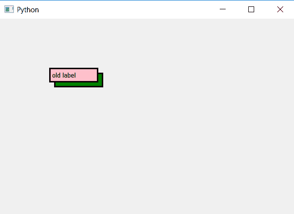

# PyQt5–标签的下()方法

> 原文:[https://www . geeksforgeeks . org/pyqt 5-标签的低方法/](https://www.geeksforgeeks.org/pyqt5-lower-method-for-labels/)

在 PyQt5 中，当我们在同一个位置创建多个标签时，它们相互重叠，这样最后制作的标签应该显示在顶部。虽然，我们可以设置不透明级别，但有时一些标签的优先级较低，这就是为什么它们应该在低于级别的原因。因此，使用了`lower()`方法。

> **语法:** label.lower()
> 
> **论证:**不需要论证。
> 
> **执行的操作:**设置标签的低优先级。

**代码:**

```
# importing the required libraries

from PyQt5.QtCore import * 
from PyQt5.QtGui import * 
from PyQt5.QtWidgets import * 
import sys

class Window(QMainWindow):
    def __init__(self):
        super().__init__()

        # set the title
        self.setWindowTitle("Python")

        # setting geometry
        self.setGeometry(100, 100, 600, 400)

        # creating a label widget
        self.label_1 = QLabel("old label ", self)

        # setting up the border and background color
        self.label_1.setStyleSheet("border :3px solid black; 
                                    background : pink")

        # moving the label
        self.label_1.move(100, 100)

        # creating a new label widget
        self.label_2 = QLabel("new Label ", self)

        # setting up the border and background color
        self.label_2.setStyleSheet("border :3px solid black;
                                    background : green")

        # setting lower priority to this label
        self.label_2.lower()

        # moving the label
        self.label_2.move(110, 110)

        # show all the widgets
        self.update()
        self.show()

# create pyqt5 app
App = QApplication(sys.argv)

# create the instance of our Window
window = Window()

# start the app
sys.exit(App.exec())
```

**输出:**
