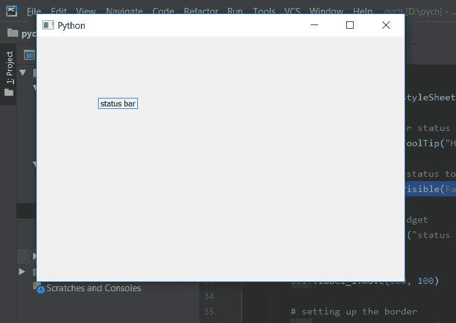

# PyQt5–使状态栏不可见

> 原文:[https://www . geeksforgeeks . org/pyqt 5-make-状态栏-不可见/](https://www.geeksforgeeks.org/pyqt5-make-status-bar-invisible/)

在本文中，我们将看到如何让状态栏对用户可见。默认情况下，当我们创建一个状态栏时，它对用户来说是清晰可见的，但是在`setVisible`设置为假的帮助下，我们可以使状态栏不可见。

> **语法:** self.statusBar()。设置可见(假)
> 
> **论证:**它以布尔为论证。
> 
> **执行的操作:**使状态栏的可见性状态为假

**代码:**

```py
from PyQt5.QtCore import * 
from PyQt5.QtGui import * 
from PyQt5.QtWidgets import * 
import sys

class Window(QMainWindow):
    def __init__(self):
        super().__init__()

        # set the title
        self.setWindowTitle("Python")

        # setting  the geometry of window
        self.setGeometry(60, 60, 600, 400)

        # setting status bar message
        self.statusBar().showMessage("This is status bar")

        # setting  border
        self.statusBar().setStyleSheet("border :3px solid black;")

        # setting tool tip for status bar
        self.statusBar().setToolTip("Hello ! from status bar")

        # setting visibility status to False
        self.statusBar().setVisible(False)

        # creating a label widget
        self.label_1 = QLabel("status bar", self)

        # moving position
        self.label_1.move(100, 100)

        # setting up the border
        self.label_1.setStyleSheet("border :1px solid blue;")

        # resizing label
        self.label_1.adjustSize()

        # show all the widgets
        self.show()

# create pyqt5 app
App = QApplication(sys.argv)

# create the instance of our Window
window = Window()

# start the app
sys.exit(App.exec())
```

**输出:**
