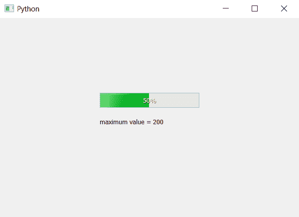

# PyQt5–进度条的最大()方法

> 原文:[https://www . geesforgeks . org/pyqt 5-进度条最大方法/](https://www.geeksforgeeks.org/pyqt5-maximum-method-for-progress-bar/)

PyQt5 中的进度条允许我们设置进度条的值范围。`maximum`方法用于获取进度条的最大值，即范围的上限。这个方法返回整数值，如果我们没有默认设置范围，它是 100。

> **语法:** bar.maximum()
> 
> **论证:**不需要论证
> 
> **返回:**返回整数。

**代码:**

```py
# importing libraries
from PyQt5.QtWidgets import * 
from PyQt5 import QtCore, QtGui
from PyQt5.QtGui import * 
from PyQt5.QtCore import * 
import sys

class Window(QMainWindow):

    def __init__(self):
        super().__init__()

        # setting title
        self.setWindowTitle("Python ")

        # setting geometry
        self.setGeometry(100, 100, 600, 400)

        # calling method
        self.UiComponents()

        # showing all the widgets
        self.show()

    # method for widgets
    def UiComponents(self):

        # creating progress bar
        bar = QProgressBar(self)

        # setting geometry to progress bar
        bar.setGeometry(200, 150, 200, 30)

        # setting maximum value of progress bar to 200
        bar.setMaximum(200)

        # setting value to progress bar
        bar.setValue(100)

        # getting maximum value of progress bar
        value = bar.maximum()

        # creating label to print the value
        label = QLabel("maximum value = " + str(value), self)

        # adjusting the size of label
        label.adjustSize()

        # moving the label
        label.move(200, 200)

        # setting alignment to centre
        bar.setAlignment(Qt.AlignCenter)

# create pyqt5 app
App = QApplication(sys.argv)

# create the instance of our Window
window = Window()

# start the app
sys.exit(App.exec())
```

**输出:**
