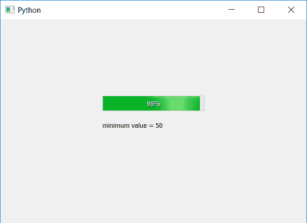

# PyQt5–进度条的最小()方法

> 原文:[https://www . geesforgeks . org/pyqt 5-进度条最小方法/](https://www.geeksforgeeks.org/pyqt5-minimum-method-for-progress-bar/)

**进度条**是我们处理冗长任务时使用的小部件。它是动画的，以便用户知道任务正在进行，它基本上是图形控制元素，用于可视化扩展计算机操作的进展，如下载、文件传输或安装。

我们可以使用`setMinimum`方法设置进度条的最小值，使用`minimum`方法获得所需进度条的最小值。

> **语法:** bar.minimum()
> 
> **论证:**不需要论证。
> 
> **返回:**返回整数，指进度条的最小值。

**代码:**

```
# importing libraries
from PyQt5.QtWidgets import * 
from PyQt5 import QtCore, QtGui
from PyQt5.QtGui import * 
from PyQt5.QtCore import * 
import sys

class Window(QMainWindow):

    def __init__(self):
        super().__init__()

        # setting title
        self.setWindowTitle("Python ")

        # setting geometry
        self.setGeometry(100, 100, 600, 400)

        # calling method
        self.UiComponents()

        # showing all the widgets
        self.show()

    # method for widgets
    def UiComponents(self):

        # creating progress bar
        bar = QProgressBar(self)

        # setting geometry to progress bar
        bar.setGeometry(200, 150, 200, 30)

        # setting minimum value of progress bar to 50
        bar.setMinimum(50)

        # setting value to progress bar
        bar.setValue(98)

        # getting minimum value of progress bar
        value = bar.minimum()

        # creating label to print the value
        label = QLabel("minimum value = " + str(value), self)

        # adjusting the size of label
        label.adjustSize()

        # moving the label
        label.move(200, 200)

        # setting alignment to centre
        bar.setAlignment(Qt.AlignCenter)

# create pyqt5 app
App = QApplication(sys.argv)

# create the instance of our Window
window = Window()

# start the app
sys.exit(App.exec())
```

**输出:**
