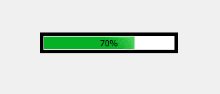
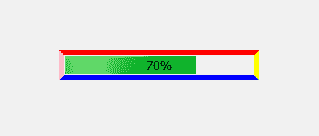
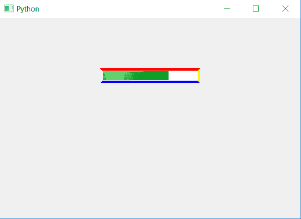

# PyQt5–多色边框进度条

> 原文:[https://www . geesforgeks . org/pyqt 5-多色-边框-进度条/](https://www.geeksforgeeks.org/pyqt5-multi-colored-border-progress-bar/)

在本文中，我们将看到如何创建进度条的多色边框。下面是普通边框进度条和多色边框进度条的图示。

 

为此我们改变了 CSS 样式表中每个边框的颜色，下面是边框样式表的代码。

```
QProgressBar
{
border :5px solid ;
border-top-color : red; 
border-left-color :pink;
border-right-color :yellow;
border-bottom-color : blue;
}

```

这个样式表是和`setStyleSheet`方法一起使用的，下面是实现。

```
# importing libraries
from PyQt5.QtWidgets import * 
from PyQt5 import QtCore, QtGui
from PyQt5.QtGui import * 
from PyQt5.QtCore import * 
import sys

class Window(QMainWindow):

    def __init__(self):
        super().__init__()

        # setting title
        self.setWindowTitle("Python ")

        # setting background color to window
        # self.setStyleSheet("background-color : yellow")

        # setting geometry
        self.setGeometry(100, 100, 600, 400)

        # calling method
        self.UiComponents()

        # showing all the widgets
        self.show()

    # method for widgets
    def UiComponents(self):
        # creating progress bar
        bar = QProgressBar(self)

        # setting geometry to progress bar
        bar.setGeometry(200, 100, 200, 30)

        # setting the value
        bar.setValue(70)

        # setting alignment to center
        bar.setAlignment(Qt.AlignCenter)

        # setting border size
        # and border color to each side
        bar.setStyleSheet("QProgressBar"
                          "{"
                          "border :5px solid ;"
                          "border-top-color : red; "
                          "border-left-color :pink;"
                          "border-right-color :yellow;"
                          "border-bottom-color : blue;"
                          "}"
                          )

App = QApplication(sys.argv)

# create the instance of our Window
window = Window()

# start the app
sys.exit(App.exec())
```

**输出:**
