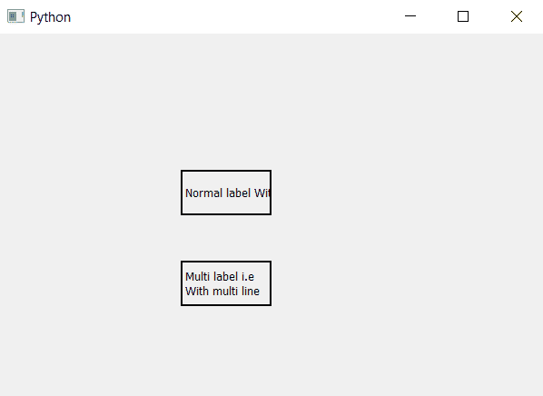

# PyQt5–多线标签

> 原文:[https://www.geeksforgeeks.org/pyqt5-multi-line-label/](https://www.geeksforgeeks.org/pyqt5-multi-line-label/)

在本文中，我们将看到如何创建多行标签，当我们创建一个标签并为其设置文本时，如果文本长度大于标签的长度，额外的文本没有显示，多行标签会使额外的文本进入另一行。下面是普通和多行标签的外观

 

为了做到这一点，我们将使用`setWordWrap`方法。

> **语法:**label . setwordwarp(True)
> 
> **自变量:**它以布尔为自变量
> 
> **返回:**无

下面是实现

```py
# importing libraries
from PyQt5.QtWidgets import * 
from PyQt5 import QtCore, QtGui
from PyQt5.QtGui import * 
from PyQt5.QtCore import * 
import sys

class Window(QMainWindow):

    def __init__(self):
        super().__init__()

        # setting title
        self.setWindowTitle("Python ")

        # setting geometry
        self.setGeometry(100, 100, 600, 400)

        # calling method
        self.UiComponents()

        # showing all the widgets
        self.show()

    # method for widgets
    def UiComponents(self):

        # creating label
        label1 = QLabel("Normal label With out multi line", self)

        # setting geometry to the label
        label1.setGeometry(200, 150, 100, 50)

        # adding border to the label
        label1.setStyleSheet("border : 2px solid black;")

        # creating label
        label2 = QLabel("Multi label i.e With multi line", self)

        # setting geometry to the label
        label2.setGeometry(200, 250, 100, 50)

        # adding border to the label
        label2.setStyleSheet("border : 2px solid black;")

        # making it multi line
        label2.setWordWrap(True)

# create pyqt5 app
App = QApplication(sys.argv)

# create the instance of our Window
window = Window()

window.show()

# start the app
sys.exit(App.exec())
```

**输出:**
