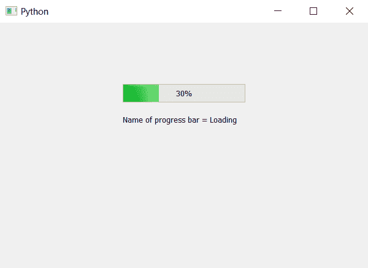

# PyQt5–进度条名称

> 原文:[https://www.geeksforgeeks.org/pyqt5-name-of-progress-bar/](https://www.geeksforgeeks.org/pyqt5-name-of-progress-bar/)

在本文中，我们将看到如何设置和获取进度条的名称。进度条的名称基本上是开发者分配给进度条的一个命名。设置名称是为了对进度条进行分类，因为在设计图形用户界面(GUI)应用程序时，进度条是为了对它们进行分类而创建的，名称是给它们的，如“加载”、“下载”、“传输”等。

为了将名称设置到进度条，使用`setAccessibleName`方法并获取名称`accessibleName`方法，如果没有指定名称`accessibleName()`方法将返回空字符串。

> **语法:**
> 
> ```py
> bar.setAccessibleName(name)
> bar.accessibleName()
> 
> ```
> 
> **论证:**
> 以弦为论证。
> `accessibleName`无需争论。
> 
> **返回:**
> 返回无。
> `accessibleName`返回字符串。

下面是实现

```py
# importing libraries
from PyQt5.QtWidgets import * 
from PyQt5 import QtCore, QtGui
from PyQt5.QtGui import * 
from PyQt5.QtCore import * 
import sys

class Window(QMainWindow):

    def __init__(self):
        super().__init__()

        # setting title
        self.setWindowTitle("Python ")

        # setting geometry
        self.setGeometry(100, 100, 600, 400)

        # calling method
        self.UiComponents()

        # showing all the widgets
        self.show()

    # method for widgets
    def UiComponents(self):
        # creating progress bar
        bar = QProgressBar(self)

        # setting geometry to progress bar
        bar.setGeometry(200, 100, 200, 30)

        # setting the value
        bar.setValue(30)

        # setting alignment to center
        bar.setAlignment(Qt.AlignCenter)

        # setting up the name
        bar.setAccessibleName("Loading")

        # getting the name
        name = bar.accessibleName()

        # creating label to display the name
        label = QLabel("Name of progress bar = " + name, self)

        # adjusting the size of label
        label.adjustSize()

        # changing the position of label
        label.move(200, 150)

App = QApplication(sys.argv)

# create the instance of our Window
window = Window()

# start the app
sys.exit(App.exec())
```

**输出:**
