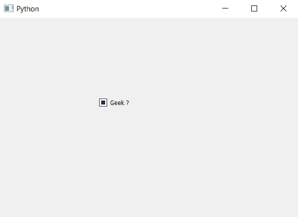

# PyQt5–复选框

的 nextCheckState()方法

> 原文:[https://www . geesforgeks . org/pyqt5-next checkstate-method-for-check-box/](https://www.geeksforgeeks.org/pyqt5-nextcheckstate-method-for-check-box/)

我们可以使用`setChecked`设置复选框的状态，或者对于三态复选框，我们可以使用`setCheckState`方法设置其状态。

`nextCheckState`设置复选框的下一个状态，即默认复选框。如果选中初始复选框状态，它将设置为取消选中，反之亦然。对于三态复选框，如果未选中，将设置为中间状态；如果初始状态为中间状态，将设置为选中；如果选中，将设置为未选中。

> **语法:**复选框. nextCheckState()
> 
> **论证:**不需要论证。
> 
> **执行的动作:**会根据之前的状态改变复选框的状态。

下面是实现。

```py
# importing libraries
from PyQt5.QtWidgets import * 
from PyQt5 import QtCore, QtGui
from PyQt5.QtGui import * 
from PyQt5.QtCore import * 
import sys

class Window(QMainWindow):

    def __init__(self):
        super().__init__()

        # setting title
        self.setWindowTitle("Python ")

        # setting geometry
        self.setGeometry(100, 100, 600, 400)

        # calling method
        self.UiComponents()

        # showing all the widgets
        self.show()

    # method for widgets
    def UiComponents(self):

        # creating the check-box
        checkbox = QCheckBox('Geek ?', self)

        # setting geometry of check box
        checkbox.setGeometry(200, 150, 100, 40)

        # making it tristate check box
        checkbox.setTristate(True)

        # setting check box to its next state
        checkbox.nextCheckState()

# create pyqt5 app
App = QApplication(sys.argv)

# create the instance of our Window
window = Window()

# start the app
sys.exit(App.exec())
```

**输出:**
