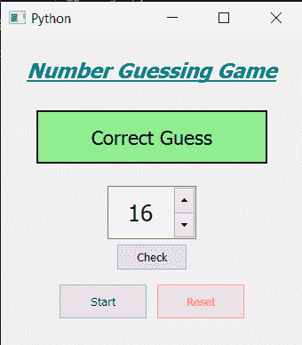

# PyQt5–猜数字游戏

> 原文:[https://www.geeksforgeeks.org/pyqt5-number-guessing-game/](https://www.geeksforgeeks.org/pyqt5-number-guessing-game/)

在本文中，我们将看到如何使用 PyQt5 创建一个数字猜测名称。数字猜谜游戏就是在给定的概率下，猜测计算机随机选择的数字。下面是游戏的样子



> **GUI 实现步骤**
> 1。创建头部标签显示游戏名称，设置其对齐字体和颜色
> 2。创建一个提供所有信息的信息标签，并设置其样式表
> 3。创建一个旋转框来改变猜测的数字
> 4。创建一个按钮来检查猜测
> 5。创建开始和重置按钮，并为它们添加颜色效果
> 
> **后端实现步骤**
> 1。创建一个存储随机数
> 2 的变量。将动作添加到开始按钮
> 3。在开始按钮动作内部，使用随机方法
> 4 获得从 1 到 20 的随机数。将文本设置为信息标签，并将其颜色更改为灰色
> 5。向检查按钮
> 6 添加动作。在检查按钮动作中，获取旋转框值，并将其与随机数
> 7 进行比较。如果数字相等，将信息标签颜色更改为绿色，并将文本设置为“正确”
> 8。否则检查是否较小，然后说数字较小，再猜一猜数字是否较大
> 9。给复位按钮
> 10 增加动作。在重置操作中，将欢迎文本设置为信息标签，并将其颜色设置为灰色

下面是实现

```
# importing libraries
from PyQt5.QtWidgets import * 
from PyQt5 import QtCore, QtGui
from PyQt5.QtGui import * 
from PyQt5.QtCore import * 
import random
import sys

class Window(QMainWindow):

    def __init__(self):
        super().__init__()

        # setting title
        self.setWindowTitle("Python ")

        # setting geometry
        self.setGeometry(100, 100, 340, 350)

        # calling method
        self.UiComponents()

        # showing all the widgets
        self.show()

        # number
        self.number = 0

    # method for components
    def UiComponents(self):

        # creating head label
        head = QLabel("Number Guessing Game", self)

        # setting geometry to the head
        head.setGeometry(20, 10, 300, 60)

        # font
        font = QFont('Times', 14)
        font.setBold(True)
        font.setItalic(True)
        font.setUnderline(True)

        # setting font to the head
        head.setFont(font)

        # setting alignment of the head
        head.setAlignment(Qt.AlignCenter)

        # setting color effect to the head
        color = QGraphicsColorizeEffect(self)
        color.setColor(Qt.darkCyan)
        head.setGraphicsEffect(color)

        # creating a label that will give the info
        self.info = QLabel("Welcome", self)

        # setting geometry to the info label
        self.info.setGeometry(40, 85, 260, 60)

        # making the info label multi line
        self.info.setWordWrap(True)

        # setting font and alignment
        self.info.setFont(QFont('Times', 13))
        self.info.setAlignment(Qt.AlignCenter)

        # setting style sheet
        self.info.setStyleSheet("QLabel"
                                "{"
                                "border : 2px solid black;"
                                "background : lightgrey;"
                                "}")

        # creating a spin box to set the number
        self.spin = QSpinBox(self)

        # setting range to the the spin box
        self.spin.setRange(1, 20)

        # setting geometry to the spin box
        self.spin.setGeometry(120, 170, 100, 60)

        # setting alignment and font
        self.spin.setAlignment(Qt.AlignCenter)
        self.spin.setFont(QFont('Times', 15))

        # creating a push button to check the guess number
        check = QPushButton("Check", self)

        # setting geometry to the push button
        check.setGeometry(130, 235, 80, 30)

        # adding action to the check button
        check.clicked.connect(self.check_action)

        # creating a start button
        start = QPushButton("Start", self)
        start.setGeometry(65, 280, 100, 40)

        # reset button to reset the game
        reset_game = QPushButton("Reset", self)

        # setting geometry to the push button
        reset_game.setGeometry(175, 280, 100, 40)

        # setting color effect
        color_red = QGraphicsColorizeEffect()
        color_red.setColor(Qt.red)
        reset_game.setGraphicsEffect(color_red)

        color_green = QGraphicsColorizeEffect()
        color_green.setColor(Qt.darkBlue)
        start.setGraphicsEffect(color_green)

        # adding action to the  button
        start.clicked.connect(self.start_action)
        reset_game.clicked.connect(self.reset_action)

    def start_action(self):

        # making label green
        self.info.setStyleSheet("QLabel"
                                "{"
                                "border : 2px solid black;"
                                "background : lightgrey;"
                                "}")

        # creating random number
        self.number = random.randint(1, 20)

        # setting text to the info label
        self.info.setText("Try to guess number between 1 to 20")

    def check_action(self):

        # get the spin box number
        user_number = self.spin.value()

        # check the value
        if user_number == self.number:

            # setting text to the info label
            self.info.setText("Correct Guess")
            # making label green
            self.info.setStyleSheet("QLabel"
                                    "{"
                                    "border : 2px solid black;"
                                    "background : lightgreen;"
                                    "}")

        elif user_number < self.number:

            # giving hint
            self.info.setText("Your number is smaller")

        else:

            # giving hint
            self.info.setText("Your number is bigger")

    def reset_action(self):
        # making label green
        self.info.setStyleSheet("QLabel"
                                "{"
                                "border : 2px solid black;"
                                "background : lightgrey;"
                                "}")

        # setting text to the info label
        self.info.setText("Welcome")

# create pyqt5 app
App = QApplication(sys.argv)

# create the instance of our Window
window = Window()

# start the app
sys.exit(App.exec())
```

**输出:**

<video class="wp-video-shortcode" id="video-427484-1" width="640" height="660" preload="metadata" controls=""><source type="video/mp4" src="https://media.geeksforgeeks.org/wp-content/uploads/20200603030323/Python-2020-06-03-03-02-43.mp4?_=1">[https://media.geeksforgeeks.org/wp-content/uploads/20200603030323/Python-2020-06-03-03-02-43.mp4](https://media.geeksforgeeks.org/wp-content/uploads/20200603030323/Python-2020-06-03-03-02-43.mp4)</video>