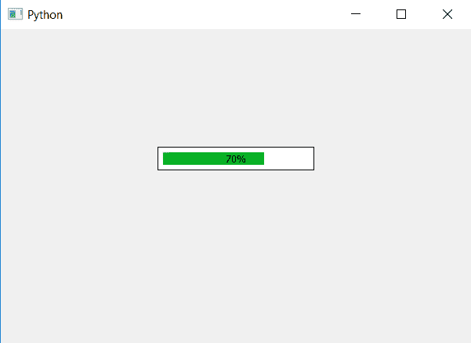

# PyQt5–进度条中的填充

> 原文:[https://www . geeksforgeeks . org/pyqt 5-进度条填充/](https://www.geeksforgeeks.org/pyqt5-padding-in-progress-bar/)

在本文中，我们将看到如何向进度条添加填充。填充是进度条边框和进度条之间的空间。下面是普通进度条和填充进度条的图示。

 

为了做到这一点，我们必须改变进度条的 CSS 样式表中的填充大小，下面是样式表代码。

```
QProgressBar
{
border : 1px solid black;
padding : 5px;
}

```

下面是实现。

```
# importing libraries
from PyQt5.QtWidgets import * 
from PyQt5 import QtCore, QtGui
from PyQt5.QtGui import * 
from PyQt5.QtCore import * 
import sys

class Window(QMainWindow):

    def __init__(self):
        super().__init__()

        # setting title
        self.setWindowTitle("Python ")

        # setting geometry
        self.setGeometry(100, 100, 600, 400)

        # calling method
        self.UiComponents()

        # showing all the widgets
        self.show()

    # method for widgets
    def UiComponents(self):
        # creating progress bar
        bar = QProgressBar(self)

        # setting geometry to progress bar
        bar.setGeometry(200, 150, 200, 30)

        # set value to progress bar
        bar.setValue(70)

        # setting alignment to center
        bar.setAlignment(Qt.AlignCenter)

        # setting padding size 
        # and border to progress bar
        bar.setStyleSheet("QProgressBar"
                          "{"
                          "border : 1px solid black;"
                          "padding : 5px;"
                          "}")

# create pyqt5 app
App = QApplication(sys.argv)

# create the instance of our Window
window = Window()

# start the app
sys.exit(App.exec())
```

**输出:**
