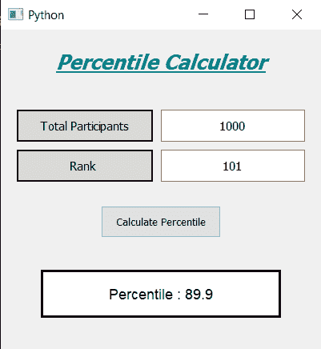

# PyQt5–百分位数计算器

> 原文:[https://www.geeksforgeeks.org/pyqt5-percentile-calculator/](https://www.geeksforgeeks.org/pyqt5-percentile-calculator/)

在本文中，我们将看到如何使用 PyQt5 创建百分位数计算器，下面是百分位数计算器的外观



> **GUI 实现步骤**
> 1。创建显示计算器名称
> 2 的标题标签。为所有学生创建标签和线编辑对，标签显示用户必须输入的内容，线编辑输入文本
> 3。同样创建一对来获得等级
> 4。创建一个按钮来计算百分位数
> 5。创建一个标签来显示计算出的百分比
> 
> **后端实现步骤**
> 1。使行编辑仅接受数字作为输入
> 2。给按钮增加动作
> 3。在按钮动作内获取行编辑的文本
> 4。检查行编辑文本是否为空或零，然后返回，以便该功能不再执行
> 5。将文本值转换为整数
> 6。计算百分比并将该值设置到标签上

下面是实现

```py
# importing libraries
from PyQt5.QtWidgets import * 
from PyQt5 import QtCore, QtGui
from PyQt5.QtGui import * 
from PyQt5.QtCore import * 
import sys

class Window(QMainWindow):

    def __init__(self):
        super().__init__()

        # setting title
        self.setWindowTitle("Python ")

        # width of window
        self.w_width = 400

        # height of window
        self.w_height = 400

        # setting geometry
        self.setGeometry(100, 100, self.w_width, self.w_height)

        # calling method
        self.UiComponents()

        # showing all the widgets
        self.show()

    # method for components
    def UiComponents(self):

        # creating head label
        head = QLabel("Percentile Calculator", self)

        # setting geometry to the head
        head.setGeometry(0, 10, 400, 60)

        # font
        font = QFont('Times', 15)
        font.setBold(True)
        font.setItalic(True)
        font.setUnderline(True)

        # setting font to the head
        head.setFont(font)

        # setting alignment of the head
        head.setAlignment(Qt.AlignCenter)

        # setting color effect to the head
        color = QGraphicsColorizeEffect(self)
        color.setColor(Qt.darkCyan)
        head.setGraphicsEffect(color)

        # creating a label
        t_label = QLabel("Total Participants", self)

        # setting properties to the  label
        t_label.setAlignment(Qt.AlignCenter)
        t_label.setGeometry(20, 100, 170, 40)
        t_label.setStyleSheet("QLabel"
                              "{"
                              "border : 2px solid black;"
                              "background : rgba(70, 70, 70, 35);"
                              "}")
        t_label.setFont(QFont('Times', 9))

        # creating a QLineEdit object to get the total participants
        self.total = QLineEdit(self)

        # accepting only number as input
        onlyInt = QIntValidator()
        self.total.setValidator(onlyInt)

        # setting properties to the line edit
        self.total.setGeometry(200, 100, 180, 40)
        self.total.setAlignment(Qt.AlignCenter)
        self.total.setFont(QFont('Times', 9))

        # creating a rank label
        r_label = QLabel("Rank ", self)

        # setting properties to the label
        r_label.setAlignment(Qt.AlignCenter)
        r_label.setGeometry(20, 150, 170, 40)
        r_label.setStyleSheet("QLabel"
                              "{"
                              "border : 2px solid black;"
                              "background : rgba(70, 70, 70, 35);"
                              "}")
        r_label.setFont(QFont('Times', 9))

        # creating a QLineEdit object to get the rank
        self.rank = QLineEdit(self)

        # accepting only number as input
        onlyInt = QIntValidator()
        self.rank.setValidator(onlyInt)

        # setting properties to the line edit
        self.rank.setGeometry(200, 150, 180, 40)
        self.rank.setAlignment(Qt.AlignCenter)
        self.rank.setFont(QFont('Times', 9))

        # creating a push button
        calculate = QPushButton("Calculate Percentile", self)

        # setting geometry to the push button
        calculate.setGeometry(125, 220, 150, 40)

        # adding action to the calculate button
        calculate.clicked.connect(self.calculate_action)

        # creating a label to show percentile
        self.result = QLabel(self)

        # setting properties to result label
        self.result.setAlignment(Qt.AlignCenter)
        self.result.setGeometry(50, 300, 300, 60)
        self.result.setStyleSheet("QLabel"
                                  "{"
                                  "border : 3px solid black;"
                                  "background : white;"
                                  "}")
        self.result.setFont(QFont('Arial', 11))

    def calculate_action(self):

        # getting total number of students
        students = self.total.text()

        # getting rank
        rank = self.rank.text()

        # if no input is given close the function
        if len(students) == 0 or len(rank) == 0:
            return

        # converting students into integer
        students = int(students)

        # converting rank into integer
        rank = int(rank)

        # if user enter total value as 0
        # return the function
        if students == 0 or rank == 0:
            return

        # variable to store the result upto 3
        # decimal points
        result = round((students - rank) / students * 100, 3)

        # setting text to the result label
        self.result.setText("Percentile : " + str(result))

    # create pyqt5 app
App = QApplication(sys.argv)

# create the instance of our Window
window = Window()

# start the app
sys.exit(App.exec())
```

**输出:**

<video class="wp-video-shortcode" id="video-434884-1" width="640" height="640" preload="metadata" controls=""><source type="video/mp4" src="https://media.geeksforgeeks.org/wp-content/uploads/20200613232227/Python-2020-06-13-23-21-26.mp4?_=1">[https://media.geeksforgeeks.org/wp-content/uploads/20200613232227/Python-2020-06-13-23-21-26.mp4](https://media.geeksforgeeks.org/wp-content/uploads/20200613232227/Python-2020-06-13-23-21-26.mp4)</video>