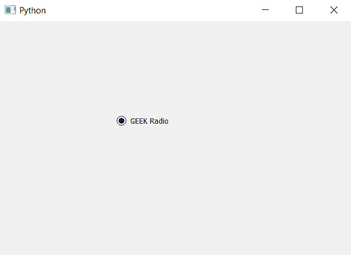

# PyQt5–检查单选按钮的程序

> 原文:[https://www . geesforgeks . org/pyqt 5-要检查的程序-单选按钮/](https://www.geeksforgeeks.org/pyqt5-program-to-check-radio-button/)

在本文中，我们将了解如何将单选按钮设置为选中状态。默认情况下，单选按钮有选中和未选中两种状态，在选中状态下，指示器被填充，而在未选中状态下，指示器为空。

为了检查程序，我们将使用`setChecked`方法。

> **语法:**单选按钮。设置选中(真)
> 
> **自变量:**它以 bool 为自变量。
> 
> **执行的动作:**将勾选单选按钮。

下面是实现。

```py
# importing libraries
from PyQt5.QtWidgets import * 
from PyQt5 import QtCore, QtGui
from PyQt5.QtGui import * 
from PyQt5.QtCore import * 
import sys

class Window(QMainWindow):

    def __init__(self):
        super().__init__()

        # setting title
        self.setWindowTitle("Python ")

        # setting geometry
        self.setGeometry(100, 100, 600, 400)

        # calling method
        self.UiComponents()

        # showing all the widgets
        self.show()

    # method for widgets
    def UiComponents(self):

        # creating a radio button
        radio_button = QRadioButton(self)

        # setting geometry of radio button
        radio_button.setGeometry(200, 150, 120, 40)

        # setting text to radio button
        radio_button.setText("GEEK Radio ")

        # setting radio button checked
        radio_button.setChecked(True)

# create pyqt5 app
App = QApplication(sys.argv)

# create the instance of our Window
window = Window()

# start the app
sys.exit(App.exec())
```

**输出:**
