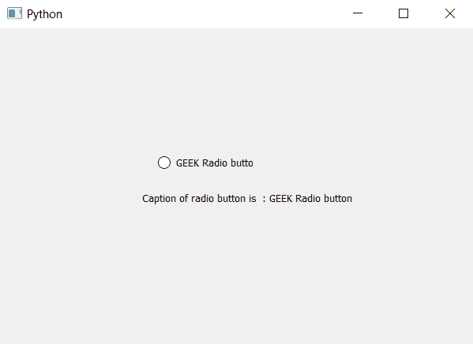

# PyQt5–获取单选按钮标题的程序

> 原文:[https://www . geesforgeks . org/pyqt 5-程序获取单选按钮标题/](https://www.geeksforgeeks.org/pyqt5-program-to-get-caption-of-radio-button/)

在本文中，我们将看到如何获取单选按钮的文本(标题)。当我们创建单选按钮时，我们给它设置一些文本，借助`setText`方法我们可以更新其中的文本。

> **实施概述:**
> 
> 1.我们将创建一个单选按钮。
> 2。借助`setText`方法给单选按钮设置一些文字。
> 3。借助`text`方法检索文本并将其保存为变量。
> 4。创建一个标签并将检索到的文本设置到它上面。

下面是实现。

```
# importing libraries
from PyQt5.QtWidgets import * 
from PyQt5 import QtCore, QtGui
from PyQt5.QtGui import * 
from PyQt5.QtCore import * 
import sys

class Window(QMainWindow):

    def __init__(self):
        super().__init__()

        # setting title
        self.setWindowTitle("Python ")

        # setting geometry
        self.setGeometry(100, 100, 600, 400)

        # calling method
        self.UiComponents()

        # showing all the widgets
        self.show()

    # method for widgets
    def UiComponents(self):

        # creating a radio button
        radio_button = QRadioButton(self)

        # setting geometry of radio button
        radio_button.setGeometry(200, 150, 120, 40)

        # setting text to radio button
        radio_button.setText("GEEK Radio button ")

        # get the text of radio button
        text = radio_button.text()

        # create label to display the text
        label = QLabel(self)

        # set text to label
        label.setText("Caption of radio button is  : " + text)

        # set the geometry of label
        label.setGeometry(180, 200, 300, 30)

# create pyqt5 app
App = QApplication(sys.argv)

# create the instance of our Window
window = Window()

# start the app
sys.exit(App.exec())
```

**输出:**
