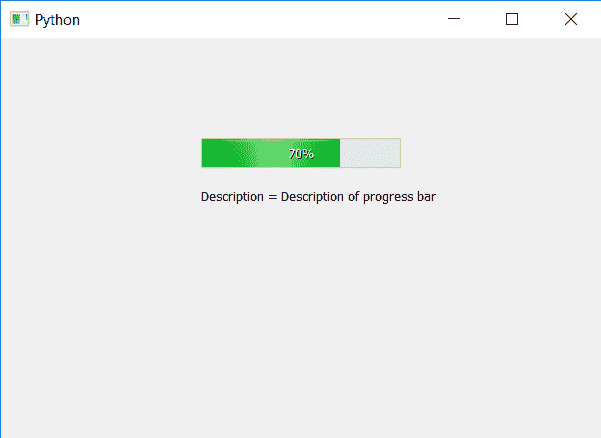

# PyQt5–进度条描述

> 原文:[https://www . geesforgeks . org/pyqt 5-进度条-描述/](https://www.geeksforgeeks.org/pyqt5-progress-bar-description/)

在本文中，我们将看到如何设置和获取进度条的描述。进度条的描述基本上是进度条的详细信息，比如进度条代表什么东西，我们做了什么格式和样式，描述没有特定的格式，可以是正常的随意语言。
为了设置进度条的描述，我们使用了 setAccessibleDescription 方法，为了获取描述，我们使用了 AccessibleDescription，如果没有设置描述，accessibleDescription 方法将以空字符串给出结果。

> **语法:**
> 
> ```
> bar.setAccessibleDescription(info)
> bar.accessibleDescription()
> ```
> 
> **参数:**
> setAccessibleDescription 以字符串为参数。
> accessibleDescription 不接受参数。
> **返回:**
> setAccessibleDescription 返回 None。
> accessibleDescription 返回字符串。

下面是实现。

## 蟒蛇 3

```
# importing libraries
from PyQt5.QtWidgets import *
from PyQt5 import QtCore, QtGui
from PyQt5.QtGui import *
from PyQt5.QtCore import *
import sys

class Window(QMainWindow):

    def __init__(self):
        super().__init__()

        # setting title
        self.setWindowTitle("Python ")

        # setting geometry
        self.setGeometry(100, 100, 600, 400)

        # calling method
        self.UiComponents()

        # showing all the widgets
        self.show()

    # method for widgets
    def UiComponents(self):
        # creating progress bar
        bar = QProgressBar(self)

        # setting geometry to progress bar
        bar.setGeometry(200, 100, 200, 30)

        # setting the value
        bar.setValue(70)

        # setting alignment to center
        bar.setAlignment(Qt.AlignCenter)

        # setting the description
        bar.setAccessibleDescription("Description of progress bar")

        # getting the description
        des = bar.accessibleDescription()

        # creating label to display description
        label = QLabel("Description = " + des, self)

        # adjusting the size of label
        label.adjustSize()

        # moving the label
        label.move(200, 150)

App = QApplication(sys.argv)

# create the instance of our Window
window = Window()

# start the app
sys.exit(App.exec())
```

**输出:**

