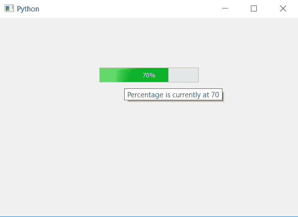

# PyQt5–进度条工具提示

> 原文:[https://www.geeksforgeeks.org/pyqt5-progress-bar-tool-tip/](https://www.geeksforgeeks.org/pyqt5-progress-bar-tool-tip/)

在本文中，我们将看到如何设置进度条的工具提示。工具提示基本上是光标悬停在进度条上时显示在屏幕上的提示。工具提示基本上会用来告诉用户完成的百分比或者还剩多少时间，为了设置工具提示我们采用`setToolTip`的方法。

> **语法:**栏. bar.settooltip(文本)
> 
> **自变量:**它以字符串为自变量。
> 
> **执行的动作:**将工具提示设置为进度条。

下面是实现。

```py
# importing libraries
from PyQt5.QtWidgets import * 
from PyQt5 import QtCore, QtGui
from PyQt5.QtGui import * 
from PyQt5.QtCore import * 
import sys

class Window(QMainWindow):

    def __init__(self):
        super().__init__()

        # setting title
        self.setWindowTitle("Python ")

        # setting background color to window
        # self.setStyleSheet("background-color : yellow")

        # setting geometry
        self.setGeometry(100, 100, 600, 400)

        # calling method
        self.UiComponents()

        # showing all the widgets
        self.show()

    # method for widgets
    def UiComponents(self):
        # creating progress bar
        bar = QProgressBar(self)

        # setting geometry to progress bar
        bar.setGeometry(200, 100, 200, 30)

        # setting the value
        value = 70
        bar.setValue(value)

        # setting alignment to center
        bar.setAlignment(Qt.AlignCenter)

        # setting tool tip
        bar.setToolTip("Percentage is currently at " + str(value))

App = QApplication(sys.argv)

# create the instance of our Window
window = Window()

# start the app
sys.exit(App.exec())
```

**输出:**
