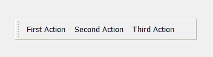
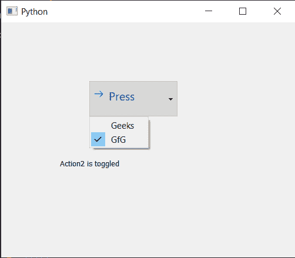

# pyqt 5–QA action

> 哎哎哎:# t0]https://www . geeksforgeeks . org/pyqt 5-QA action/

**qaaction:**在 PyQt5 应用程序中，许多常见的命令可以通过菜单、工具栏按钮和键盘快捷键来调用，因为用户希望每个命令都以相同的方式执行，而不管使用的用户界面如何，qaaction 将每个命令表示为一个操作非常有用。动作可以添加到菜单和工具栏中，并自动保持同步。例如，在文字处理器中，如果用户按下粗体工具栏按钮，粗体菜单项将被自动选中。

下面是一个动作在工具栏
中的样子

语法:

```
action = QAction(name)

```

这个动作可以借助`addAction`和`addActions`方法添加到工具栏或 QMenus 中。下面是一些经常与 QAction 一起使用的命令

```
setCheckable : To make QAction Chekable

setIcon : To add icon to the QAction

setText : To set the display name of the QAction

text : To get the display name of the QAction

setPriority : To set the priority of the action

triggered.connect : To connect an method with it when triggered signal is emitted

```

**示例:**
在这个示例中，我们将创建一个主窗口，它有一个工具栏，标签和工具栏由 QAction 组成，每个 QAction 都有单独的方法与之连接，下面是实现

```
# importing libraries
from PyQt5.QtWidgets import * from PyQt5 import QtCore, QtGui
from PyQt5.QtGui import * from PyQt5.QtCore import * import sys

class Window(QMainWindow):

    def __init__(self):
        super().__init__()

        # setting title
        self.setWindowTitle("Python ")

        # setting geometry
        self.setGeometry(100, 100, 500, 400)

        # calling method
        self.UiComponents()

        # showing all the widgets
        self.show()

    # method for components
    def UiComponents(self):

        # creating a tool bar
        toolbar = QToolBar(self)

        # setting geometry to the tool bar
        toolbar.setGeometry(50, 100, 300, 35)

        # creating QAction Instances
        action1 = QAction("First Action", self)
        action2 = QAction("Second Action", self)
        action3 = QAction("Third Action", self)

        # adding these actions to the tool bar
        toolbar.addAction(action1)
        toolbar.addAction(action2)
        toolbar.addAction(action3)

        # creating a label
        label = QLabel("GeeksforGeeks", self)

        # setting geometry to the label
        label.setGeometry(100, 150, 200, 50)

        # adding triggered action to the first action
        action1.triggered.connect(lambda: label.setText("First Action Triggered"))

        # adding triggered action to the second action
        action2.triggered.connect(lambda: label.setText("Second Action Triggered"))

        # adding triggered action to the third action
        action3.triggered.connect(lambda: label.setText("Third Action Triggered"))

# create pyqt5 app
App = QApplication(sys.argv)

# create the instance of our Window
window = Window()

# start the app
sys.exit(App.exec())
```

**输出:**

<video class="wp-video-shortcode" id="video-471375-1" width="640" height="512" preload="metadata" controls=""><source type="video/mp4" src="https://media.geeksforgeeks.org/wp-content/uploads/20200819004513/Python-2020-08-19-00-44-53.mp4?_=1">[https://media.geeksforgeeks.org/wp-content/uploads/20200819004513/Python-2020-08-19-00-44-53.mp4](https://media.geeksforgeeks.org/wp-content/uploads/20200819004513/Python-2020-08-19-00-44-53.mp4)</video>

**另一个例子**
在这个例子中，我们将创建一个 commandlink 按钮，并向其添加菜单，该菜单具有 QAction，下面是实现

```
# importing libraries
from PyQt5.QtWidgets import * from PyQt5 import QtCore, QtGui
from PyQt5.QtGui import * from PyQt5.QtCore import * import sys

class Window(QMainWindow):

    def __init__(self):
        super().__init__()

        # setting title 
        self.setWindowTitle("Python ")

        # setting geometry 
        self.setGeometry(100, 100, 500, 400)

        # calling method 
        self.UiComponents()

        # showing all the widgets 
        self.show()

        # method for components

    def UiComponents(self):
        # creating a command link button
        cl_button = QCommandLinkButton("Press", self)

        # setting geometry 
        cl_button.setGeometry(150, 100, 150, 60)

        # QActions 
        action1 = QAction("Geeks", self)
        action2 = QAction("GfG", self)

        # making action2 checkable
        action2.setCheckable(True)

        # QMenu 
        menu = QMenu()

        # adding actions to menu 
        menu.addActions([action1, action2])

        # setting menu to the button 
        cl_button.setMenu(menu)

        # creating label 
        label = QLabel("GeeksforGeeks", self)

        # setting label geometry 
        label.setGeometry(100, 200, 300, 80)

        # making label multiline 
        label.setWordWrap(True)

        # adding method to the action
        action1.triggered.connect(lambda: label.setText("Action1 is triggered"))

        # adding method to the action2 when it get checked
        action2.toggled.connect(lambda: label.setText("Action2 is toggled"))

# create pyqt5 app
App = QApplication(sys.argv)

# create the instance of our Window 
window = Window()

# start the app 
sys.exit(App.exec()) 
```

**输出:**
