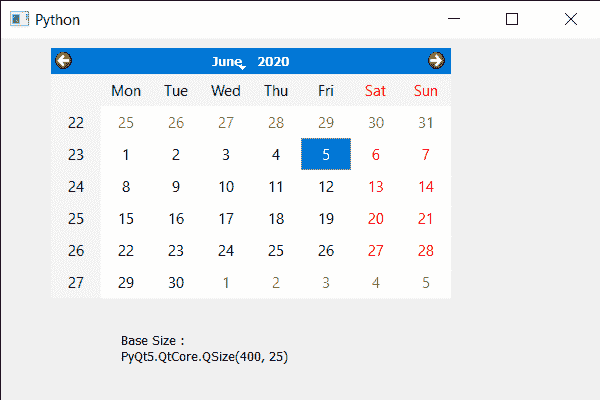

# PyQt5 QCalendarWidget–访问基本大小值

> 原文:[https://www . geeksforgeeks . org/pyqt 5-qcalendarwidget-access-base-size-value/](https://www.geeksforgeeks.org/pyqt5-qcalendarwidget-accessing-base-size-value/)

在本文中，我们将看到如何访问 QCalendarWidget 的基本大小值。默认情况下，宽度和高度的基本大小都为零，如果日历定义了大小增量，即当窗口大小改变时，其大小会改变，则基本大小用于计算适当的日历大小。基本大小是日历的初始大小。基本尺寸可以在 setBaseSize 方法的帮助下设置到日历中。

> 为此，我们将对 QCalendarWidget 对象使用 baseSize 方法。
> **语法:** calendar.baseSize()
> **参数:**不需要参数
> **返回:**返回 QSize 对象

下面是实现:

## 蟒蛇 3

```
# importing libraries
from PyQt5.QtWidgets import *
from PyQt5 import QtCore, QtGui
from PyQt5.QtGui import *
from PyQt5.QtCore import *
import sys

class Window(QMainWindow):

    def __init__(self):
        super().__init__()

        # setting title
        self.setWindowTitle("Python ")

        # setting geometry
        self.setGeometry(100, 100, 600, 400)

        # calling method
        self.UiComponents()

        # showing all the widgets
        self.show()

    # method for components
    def UiComponents(self):

        # creating a QCalendarWidget object
        self.calendar = QCalendarWidget(self)

        # setting geometry to the calendar
        self.calendar.setGeometry(50, 10, 400, 250)

        # setting base size
        self.calendar.setBaseSize(400, 25)

        # creating a label
        label = QLabel(self)

        # setting geometry
        label.setGeometry(120, 280, 200, 60)

        # making it multi line
        label.setWordWrap(True)

        # getting the base size
        value = self.calendar.baseSize()

        # setting text to the label
        label.setText("Base Size : " + str(value))

# create pyqt5 app
App = QApplication(sys.argv)

# create the instance of our Window
window = Window()

# start the app
sys.exit(App.exec())
```

**输出:**

