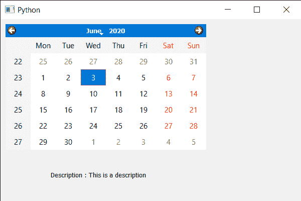

# PyQt5 QCalendarWidget–访问描述属性

> 原文:[https://www . geeksforgeeks . org/pyqt 5-qcalendarwidget-access-description-property/](https://www.geeksforgeeks.org/pyqt5-qcalendarwidget-accessing-description-property/)

在本文中，我们将看到如何获得 QCalendarWidget 的描述属性。Description 属性保存日历的详细信息，即日历是如何制作的以及与之相关的重要事项等所有详细信息。默认情况下，description 为空字符串，尽管我们可以在 setAccessibleDescription 方法的帮助下随时添加描述。

> 为此，我们将对 QCalendarWidget 对象使用 accessibleDescription 方法。
> **语法:**calendar . accessibledescription()
> **参数:**不需要参数
> **执行的动作:**返回字符串

下面是实现

## 蟒蛇 3

```
# importing libraries
from PyQt5.QtWidgets import *
from PyQt5 import QtCore, QtGui
from PyQt5.QtGui import *
from PyQt5.QtCore import *
import sys

class Window(QMainWindow):

    def __init__(self):
        super().__init__()

        # setting title
        self.setWindowTitle("Python ")

        # setting geometry
        self.setGeometry(100, 100, 600, 400)

        # calling method
        self.UiComponents()

        # showing all the widgets
        self.show()

    # method for components
    def UiComponents(self):

        # creating a QCalendarWidget object
        calendar = QCalendarWidget(self)

        # setting geometry to the calendar
        calendar.setGeometry(10, 10, 400, 250)

        # setting description
        calendar.setAccessibleDescription("This is a description")

        # creating a label
        label = QLabel(self)

        # setting geometry to the label
        label.setGeometry(100, 280, 250, 60)

        # making label multi line
        label.setWordWrap(True)

        # getting description
        value = calendar.accessibleDescription()

        # setting text to the label
        label.setText("Description : " + str(value))

# create pyqt5 app
App = QApplication(sys.argv)

# create the instance of our Window
window = Window()

# start the app
sys.exit(App.exec())
```

**输出:**

