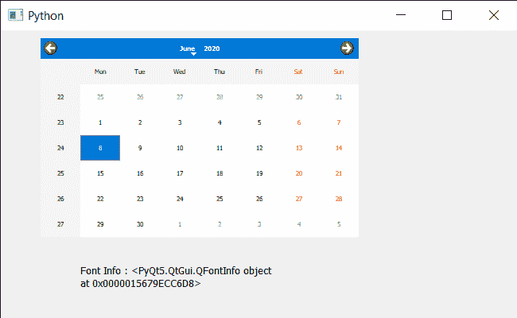

# PyQt5 QCalendarWidget–访问字体信息

> 原文:[https://www . geeksforgeeks . org/pyqt 5-qcalendarwidget-access-font-information/](https://www.geeksforgeeks.org/pyqt5-qcalendarwidget-accessing-font-information/)

在本文中，我们将看到如何获取 QCalendarWidget 的字体信息。字体是字体的特定大小、重量和样式。每种字体都是一组匹配的字体，每个字形一个。通过改变字体，我们可以改变日历中文本的样式。我们可以使用 set font 方法更改/设置字体。字体信息告诉你字体的质量，比如是否加粗，是否倾斜，像素大小和许多其他信息。

> 为此，我们将对 QCalendarWidget 对象使用 fontInfo 方法。
> **语法:** calendar.fontInfo()
> **参数:**不需要参数
> **返回:**返回 QFontInfo 对象

下面是实现

## 蟒蛇 3

```py
# importing libraries
from PyQt5.QtWidgets import *
from PyQt5 import QtCore, QtGui
from PyQt5.QtGui import *
from PyQt5.QtCore import *
import sys

class Window(QMainWindow):

    def __init__(self):
        super().__init__()

        # setting title
        self.setWindowTitle("Python ")

        # setting geometry
        self.setGeometry(100, 100, 650, 400)

        # calling method
        self.UiComponents()

        # showing all the widgets
        self.show()

    # method for components
    def UiComponents(self):
        # creating a QCalendarWidget object
        self.calendar = QCalendarWidget(self)

        # setting geometry to the calendar
        self.calendar.setGeometry(50, 10, 400, 250)

        # setting cursor
        self.calendar.setCursor(Qt.PointingHandCursor)

        # font
        font = QFont('Times', 5)

        # setting font to the calendar
        self.calendar.setFont(font)

        # creating label to show the properties
        self.label = QLabel(self)

        # setting geometry to the label
        self.label.setGeometry(100, 280, 250, 60)

        # making label multi line
        self.label.setWordWrap(True)

        # getting font Info Object
        value = self.calendar.fontInfo()

        # setting text to the label
        self.label.setText("Font Info : " + str(value))

# create pyqt5 app
App = QApplication(sys.argv)

# create the instance of our Window
window = Window()

# start the app
sys.exit(App.exec())
```

**输出:**

