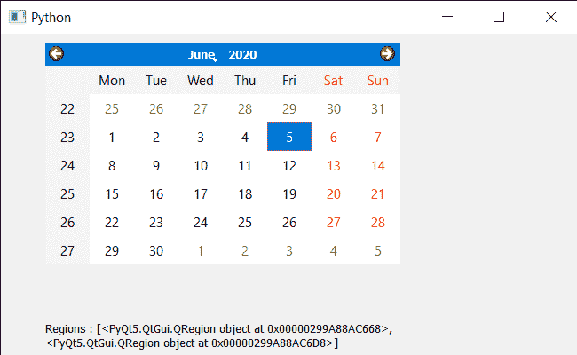

# PyQt5 QCalendarWidget–如果可能的话访问每个孩子的区域

> 原文:[https://www . geeksforgeeks . org/pyqt 5-qcalendarwidget-访问每个孩子的区域-如果可能/](https://www.geeksforgeeks.org/pyqt5-qcalendarwidget-accessing-region-of-each-children-if-possible/)

在本文中，我们将看到如何获得 QCalendarWidget 所有子代的区域。日历不是一个单独的小部件，它是许多小部件的混合物，我们称之为日历的孩子。有许多子视图，如表视图、项委托等，我们使用 children 方法来获取它的所有子视图。区域是每个孩子占据的区域。

**注意:**所有的孩子都没有矩形，因为他们可以是一个布局。

> 为了做到这一点，我们必须做到以下几点:
> 1。创建日历小部件
> 2。获得所有孩子的日历
> 3。遍历孩子列表
> 4。尝试获取可见区域或子区域，除了在另一个列表
> 5 中阻止并保存结果。使用标签
> 显示列表

下面是实现

## 蟒蛇 3

```
# importing libraries
from PyQt5.QtWidgets import *
from PyQt5 import QtCore, QtGui
from PyQt5.QtGui import *
from PyQt5.QtCore import *
import sys

class Window(QMainWindow):

    def __init__(self):
        super().__init__()

        # setting title
        self.setWindowTitle("Python ")

        # setting geometry
        self.setGeometry(100, 100, 650, 400)

        # calling method
        self.UiComponents()

        # showing all the widgets
        self.show()

    # method for components
    def UiComponents(self):

        # creating a QCalendarWidget object
        self.calendar = QCalendarWidget(self)

        # setting geometry to the calendar
        self.calendar.setGeometry(50, 10, 400, 250)

        # creating a label
        label = QLabel(self)

        # setting geometry
        label.setGeometry(50, 280, 420, 120)

        # making it multi line
        label.setWordWrap(True)

        # getting children
        children = self.calendar.children()

        value = []
        for i in children:
            try:

                try:
                    # getting children region
                    region = i.childrenRegion()
                except:
                    # getting visible region
                    region = i.visibleRegion()

                # adding it to list
                value.append(region)

            except:
                pass

        # setting text to the label
        label.setText("Regions : " + str(value))

# create pyqt5 app
App = QApplication(sys.argv)

# create the instance of our Window
window = Window()

# start the app
sys.exit(App.exec())
```

**输出:**

