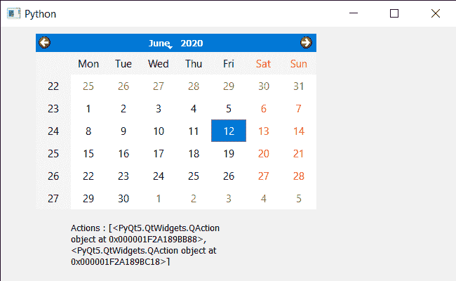

# PyQt5 QCalendarWidget–添加多个动作

> 原文:[https://www . geeksforgeeks . org/pyqt 5-qcalendarwidget-add-multi-QA action/](https://www.geeksforgeeks.org/pyqt5-qcalendarwidget-adding-multiple-qaction/)

在本文中，我们将看到如何同时向 QCalendarWidget 添加多个 QAction。为了做到这一点，我们使用`addActions`方法，该方法将动作附加到日历的动作列表中。我们可以借助`actions`方法得到所有的动作。

> 为此，我们将对 QCalendarWidget 对象使用`addActions`方法。
> 
> **语法:**calendar . addactions(action _ list)
> 
> **自变量:**以列表为自变量
> 
> **返回:**不返回

下面是实现

```
# importing libraries
from PyQt5.QtWidgets import * 
from PyQt5 import QtCore, QtGui
from PyQt5.QtGui import * 
from PyQt5.QtCore import * 
import sys

# QCalendarWidget Class
class Calendar(QCalendarWidget):

    # constructor
    def __init__(self, parent = None):
        super(Calendar, self).__init__(parent)

class Window(QMainWindow):

    def __init__(self):
        super().__init__()

        # setting title
        self.setWindowTitle("Python ")

        # setting geometry
        self.setGeometry(100, 100, 650, 400)

        # calling method
        self.UiComponents()

        # showing all the widgets
        self.show()

    # method for components
    def UiComponents(self):

        # creating a QCalendarWidget object
        # as Calendar class inherits QCalendarWidget
        self.calendar = Calendar(self)

        # setting geometry to the calender
        self.calendar.setGeometry(50, 10, 400, 250)

        # setting cursor
        self.calendar.setCursor(Qt.PointingHandCursor)

        # creating a QAction objects
        action1 = QAction("Geek", self)
        action2 = QAction("Python", self)

        # creating action list
        action_list = [action1, action2]

        # adding actions to calendar
        self.calendar.addActions(action_list)

        # creating label to show the properties
        self.label = QLabel(self)

        # setting geometry to the label
        self.label.setGeometry(100, 280, 250, 60)

        # making label multi line
        self.label.setWordWrap(True)

        # getting action of the calendar
        value = self.calendar.actions()

        # setting text to the label
        self.label.setText("Actions : " + str(value))

# create pyqt5 app
App = QApplication(sys.argv)

# create the instance of our Window
window = Window()

# start the app
sys.exit(App.exec())
```

**输出:**
