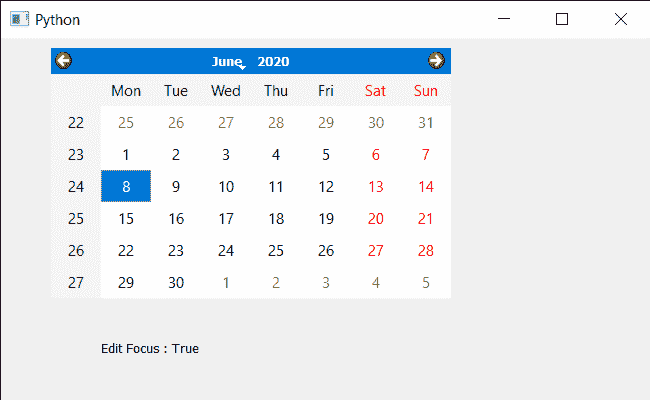

# PyQt5 QCalendarWidget–检查编辑焦点属性

> 原文:[https://www . geesforgeks . org/pyqt5-qcalendarwidget-checking-edit-focus-property/](https://www.geeksforgeeks.org/pyqt5-qcalendarwidget-checking-edit-focus-property/)

在本文中，我们将看到如何检查 QCalendarWidget 的编辑焦点是否启用。如果启用此属性，它将使日历具有编辑焦点，在这种情况下，Qt::Key_Up 和 Qt::Key_Down 将正常传递给日历；否则，使用 Qt::Key_Up 和 Qt::Key_Down 来改变焦点。可以使用`setEditFocus`方法启用或禁用。

**注意:**此功能仅在嵌入式 Linux 的 Qt 中可用。

> 为此，我们将对 QCalendarWidget 对象使用`hasEditFocus`方法。
> 
> **语法:** calendar.hasEditFocus()
> 
> **论证:**不需要论证
> 
> **返回:**返回 bool

下面是实现

```py
# importing libraries
from PyQt5.QtWidgets import * 
from PyQt5 import QtCore, QtGui
from PyQt5.QtGui import * 
from PyQt5.QtCore import * 
import sys

class Window(QMainWindow):

    def __init__(self):
        super().__init__()

        # setting title
        self.setWindowTitle("Python ")

        # setting geometry
        self.setGeometry(100, 100, 650, 400)

        # calling method
        self.UiComponents()

        # showing all the widgets
        self.show()

    # method for components
    def UiComponents(self):

        # creating a QCalendarWidget object
        self.calendar = QCalendarWidget(self)

        # setting geometry to the calender
        self.calendar.setGeometry(50, 10, 400, 250)

        # setting cursor
        self.calendar.setCursor(Qt.PointingHandCursor)

        # enabling edit focus
        self.calendar.setEditFocus(True)

        # creating label to show the properties
        self.label = QLabel(self)

        # setting geometry to the label
        self.label.setGeometry(100, 280, 250, 60)

        # making label multi line
        self.label.setWordWrap(True)

        # checking edit focus
        value = self.calendar.hasEditFocus()

        # setting text to the label
        self.label.setText("Edit Focus : " + str(value))

# create pyqt5 app
App = QApplication(sys.argv)

# create the instance of our Window
window = Window()

# start the app
sys.exit(App.exec())
```

**输出:**
