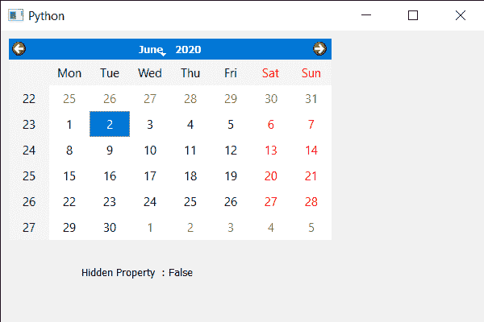

# PyQt5 QCalendarWidget–检查隐藏属性

> 原文:[https://www . geeksforgeeks . org/pyqt 5-qcalendarwidget-checking-hidden-property/](https://www.geeksforgeeks.org/pyqt5-qcalendarwidget-checking-hidden-property/)

在本文中，我们将看到如何检查 QCalendarWidget 的隐藏属性，隐藏与显示 QCalendarWidget 完全相反。日历小部件是一个很大的小部件，因此当用户不需要时，需要隐藏它。我们可以使用`hide`方法隐藏它，但是我们不能使用相同的方法取消隐藏它，尽管该方法改变了隐藏属性。我们用`setHidden`方法改变隐藏属性。

> 为此，我们将对 QCalendarWidget 对象使用`isHidden`方法。
> 
> **语法:** calendar.isHidden()
> 
> **论证:**不需要论证
> 
> **返回:**返回 bool

下面是实现

```
# importing libraries
from PyQt5.QtWidgets import * 
from PyQt5 import QtCore, QtGui
from PyQt5.QtGui import * 
from PyQt5.QtCore import * 
import sys

class Window(QMainWindow):

    def __init__(self):
        super().__init__()

        # setting title
        self.setWindowTitle("Python ")

        # setting geometry
        self.setGeometry(100, 100, 600, 400)

        # calling method
        self.UiComponents()

        # showing all the widgets
        self.show()

    # method for components
    def UiComponents(self):

        # creating a QCalendarWidget object
        calender = QCalendarWidget(self)

        # setting geometry to the calender
        calender.setGeometry(10, 10, 400, 250)

        # creating label
        label = QLabel(self)

        # setting geometry to the label
        label.setGeometry(100, 270, 250, 60)

        # making label multi line
        label.setWordWrap(True)

        # checking hidden property
        check = calender.isHidden()

        # setting text to the label
        label.setText("Hidden Property  : " + str(check))

# create pyqt5 app
App = QApplication(sys.argv)

# create the instance of our Window
window = Window()

# start the app
sys.exit(App.exec())
```

**输出:**
