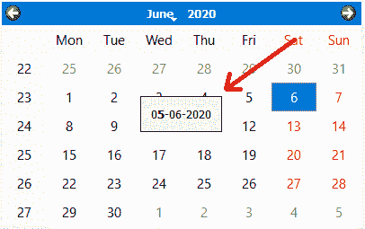
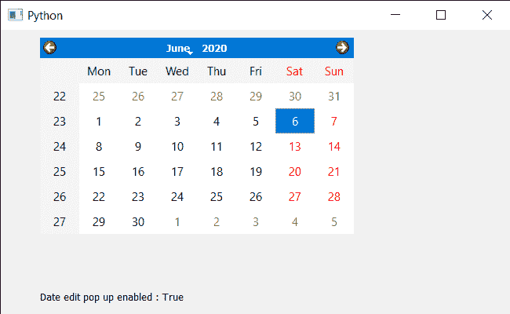

# PyQt5 QCalendarWidget–检查日期编辑弹出窗口是启用还是禁用

> 原文:[https://www . geesforgeks . org/pyqt5-qcalendarwidget-checking-date-edit-pop-is-enabled-or-disabled/](https://www.geeksforgeeks.org/pyqt5-qcalendarwidget-checking-if-date-edit-pop-up-is-enabled-or-disabled/)

在本文中，我们将看到如何检查 QCalendarWidget 的日期编辑弹出窗口是否已启用。默认情况下，日期编辑弹出窗口处于启用状态，日期编辑在外观上比日期编辑更简单，但允许用户使用左右光标键在字段之间导航，使用上下光标键递增和递减单个字段，以及直接使用数字键输入值。弹出窗口可以在 setDateEditEnabled 方法的帮助下启用或禁用，下面是日期编辑弹出窗口的样子



> 为此，我们将对 QCalendarWidget 对象使用 isDateEditEnabled 方法。
> **语法:**calendar . isdateeditenabled()
> **参数:**不需要参数
> **返回:**返回 bool

下面是实现

## 蟒蛇 3

```py
# importing libraries
from PyQt5.QtWidgets import *
from PyQt5 import QtCore, QtGui
from PyQt5.QtGui import *
from PyQt5.QtCore import *
import sys

class Window(QMainWindow):

    def __init__(self):
        super().__init__()

        # setting title
        self.setWindowTitle("Python ")

        # setting geometry
        self.setGeometry(100, 100, 650, 400)

        # calling method
        self.UiComponents()

        # showing all the widgets
        self.show()

    # method for components
    def UiComponents(self):

        # creating a QCalendarWidget object
        self.calender = QCalendarWidget(self)

        # setting geometry to the calendar
        self.calender.setGeometry(50, 10, 400, 250)

        # setting cursor
        self.calender.setCursor(Qt.PointingHandCursor)

        # enabling the date edit popup
        self.calender.setDateEditEnabled(True)

        # creating a label
        label = QLabel(self)

        # setting geometry
        label.setGeometry(50, 280, 420, 120)

        # making it multi line
        label.setWordWrap(True)

        # checking if pop-up is enabled
        value = self.calender.isDateEditEnabled()

        # setting text to the label
        label.setText("Date edit pop up enabled : " + str(value))

# create pyqt5 app
App = QApplication(sys.argv)

# create the instance of our Window
window = Window()

# start the app
sys.exit(App.exec())
```

**输出:**

