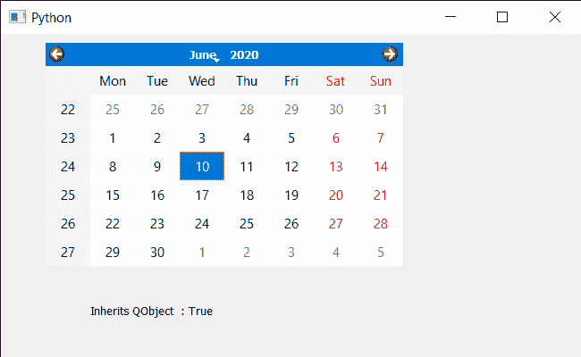

# PyQt5 QCalendarWidget–检查它是否继承给定的类

> 原文:[https://www . geeksforgeeks . org/pyqt5-qcalendarwidget-checking-if-it-inherits-given-class/](https://www.geeksforgeeks.org/pyqt5-qcalendarwidget-checking-if-it-inherits-given-class/)

在本文中，我们将看到如何检查 QCalendarWidget 是否继承了其他类。为此，我们使用 inherits 属性，如果日历对象是继承 className 的类或继承 className 的 QObject 子类的实例，则该属性返回 true 否则返回 false。
**注:**一个类被认为是继承自身。

> 为此，我们将对 QCalendarWidget 对象使用 inherits 方法。
> **语法:**calendar . inherits(“QObject”)
> **引数:**以字符串为引数即类名
> **返回:**返回 bool

下面是实现

## 蟒蛇 3

```
# importing libraries
from PyQt5.QtWidgets import *
from PyQt5 import QtCore, QtGui
from PyQt5.QtGui import *
from PyQt5.QtCore import *
import sys

class Window(QMainWindow):

    def __init__(self):
        super().__init__()

        # setting title
        self.setWindowTitle("Python ")

        # setting geometry
        self.setGeometry(100, 100, 650, 400)

        # calling method
        self.UiComponents()

        # showing all the widgets
        self.show()

    # method for components
    def UiComponents(self):

        # creating a QCalendarWidget object
        self.calendar = QCalendarWidget(self)

        # setting geometry to the calendar
        self.calendar.setGeometry(50, 10, 400, 250)

        # setting cursor
        self.calendar.setCursor(Qt.PointingHandCursor)

        # creating label to show the properties
        self.label = QLabel(self)

        # setting geometry to the label
        self.label.setGeometry(100, 280, 250, 60)

        # making label multi line
        self.label.setWordWrap(True)

        # checking if calendar inherits QObject
        value = self.calendar.inherits("QObject")

        # setting text to the label
        self.label.setText("Inherits QObject  : " + str(value))

# create pyqt5 app
App = QApplication(sys.argv)

# create the instance of our Window
window = Window()

# start the app
sys.exit(App.exec())
```

**输出:**

